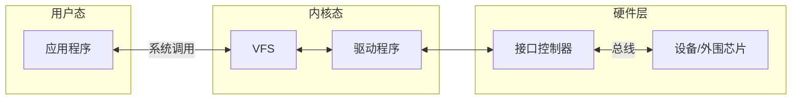

# Linux 驱动程序开发实例（第2版）

> 设备驱动程序代码是Linux内核代码中最多的部分。\
> 操作系统最重要的功能之一就是支持各类设备的访问，承担硬件与应用软件之间的桥梁作用。\
> Linux操作系统中主要包括字符设备、块设备、网络设备等三类基本的设备驱动程序，\
> 内核中的设备驱动程序大部分基于这三类设备驱动。

## 第一章 Linux 设备驱动程序入门

### 1.1 设备驱动程序基础

#### 1.1.1 驱动程序的概念

> Linux驱动程序运行原理


> 驱使设备按照用户的预期进行工作的软件，应用程序与设备沟通的桥梁。\
> 设备驱动程序主要负责硬件设备的`参数配置`、`数据读写`与`中断处理`。\
> Linux的运行空间分为`内核空间`与`用户空间`。\
> 为了保护系统的安全，这两个空间各自运行在不同的级别，不能相互直接访问和共享数据。\
> Linux内核为应用层提供了一系列系统调用接口，应用程序可以通过这组接口来获得操作系统内核提供的服务。\
> 应用层程序运行在用户态，\
> 设备驱动程序是操作系统的一部分，运行在内核态。\
> 应用程序要控制硬件设备，首先通过系统调用访问内核，内核层根据系统调用号来调用驱动程序对应的接口函数来访问设备。\
> Linux中的大部分驱动程序是以内核模块的形式编写的。\
> 内核模块是Linux内核向外部提供的一个接口，全称**动态可加载内核模块**（Loadable Kernel Module，LKM）。\
> Linux内核本身是一个**单内核**（monolithic kernel）
> > 优点：效率高。\
> > 缺点：可扩展性差、可维护性差。
>
> **模块机制**弥补上述缺陷。\
> 内核模块可以被单独编译，在运行时被链接到内核作为内核的一部分在内核空间运行。\
> 让内核支持可加载模块，需要配置内核的 `[Enable loadable module support]` 选项。

#### 1.1.2 驱动程序的加载方式

> Linux 设备驱动程序又两中加载方式。
> 1. 直接编译进Linux内核，在Linux启动时加载
> 2. 采用内核模块方式，可动态加载和卸载

> 希望将驱动程序编译进内核，需要修改内核代码和编译选项。\
> 驱动程序代码源文件为 `infrared_s3c2410.c` \
> 将 `infrared_s3c2410.c` 复制到内核代码的 `/drivers/char`目录 \
> 并在该目录下的 `Kconfig` 文件最后增加如下语句
> ```
> config INFRARED_REMOTE
>      tristate "INFRARED Driver for REMOTE"
>      depends on ARCH_S3C64XX||ARCH_S3C2410
>      default y
>      help
> ```
> 在该目录下的 `Makefile` 中添加如下语句 \
> `Obj-$(CONFIG_INFRARED_REMOTE)+=infrared_s3c2410.o` \
> 进入Linux内核源代码目录，执行 `make menuconfig` 命令，选择 `device drivers`->`character devices` \
> 进入内核配置窗口，可见最后一行即新增的驱动 \
> 在内核配置窗口中可以使用上下键、空格键和回车键进行选择、移动和取消选择。 \
> 内核配置窗口中以`<>`带头的行是内核模块的配置，以`[]`带头的行是内核功能的配置。 \
> > `<*>`表示相应的模块将被编译进内核。 \
> > `<>`表示不编译进内核。\
> > `<M>`表示编译成可加载模块。\
>
> 将 `[INFRARED Driver for REMOTE]` 行前面设置为`<*>`，则 `infrared_s3c2410.o` 将被编译进内核。\
> 使用 `make zImage` 命令编译内核时所设置为`<*>`的项将被包含在内核映像中。

> 可加载模块方式让驱动程序的运行更加灵活，更利于调试。\
> 可加载模块用于扩展Linux操作系统的功能。\
> 使用内核模块可以按需加载，不需要重新编译内核。\
> 这种方式控制内核大小，模块一旦被插入内核，就和内核其他部分一样，可以访问内核的地址空间、函数和数据。\
> 可加载模块通常以 `.ko` 为扩展名。\
> 内核配置窗口中`<M>`表示编译成可加载模块。\
> 使用 `make modules` 命令编译内核时，所有设置为`<M>`的项将被编译。\
> `make modules` 结束后，可以使用下面的命令安装内核中的可加载模块文件到一个指定的目录\
> `make modules_install INSTALL_MOD_PATH=/home/usr/modules`\
> 使用 `make` 命令编译内核相当一执行 `make zImage` 和 `make modules`两个命令

#### [1.1.3 编写可加载模块](https://github.com/bougainvilleas/aio/tree/develop/c/kernel/instance/chapter01/1-1simple)

> Linux内核模块必须包含以下两个接口
> > `module_init(your_init_func);`//模块初始化接口 \
> > `module_exit(your_exit_func);`//模块卸载接口
>
> 加载一个内核模块的命令是 `insmod`
> > `insmod modulename.ko`
>
> 卸载一个内核模块的命令是 `rmmod`
> > `rmmod modulename`
>
> 可加载模块的源代码可以放在内核代码树中，也可以独立于内核代码树。\
> 独立于内核代码树，需要为可加载模块编写`makefile`文件。\
> `makefile`文件最重要的就是设置如下几个变量
> ```
> CC = arm-none-linux-gnueabi-gcc # CC是编译器
> obj-m := smodule.o # 需要编译的目标模块
> # ArchLinux内核路径 需要安装`base-devel`和`linux-headers`
> # /lib/modules/6.3.1-arch1-1/build/
> KERNELDIR ?= /lib/modules/$(shell uname -r)/build/ 
> ```
> 注意在编写可加载模块前先要有一个`内核代码目录树` \
> `KERNELDIR` 的内核版本必须与运行的内核版本一致，否则编译出的模块往往无法加载

#### [1.1.4 带参数的可加载模块](https://github.com/bougainvilleas/aio/tree/develop/c/kernel/instance/chapter01/1-2module)

#### [1.1.5 模块依赖](https://github.com/bougainvilleas/aio/tree/develop/c/kernel/instance/chapter01/1-10export)

#### 1.1.6 printk 的等级

> 内核态的打印函数 `printk` 可以设定打印信息的等级
>
> ```
> int console_printk[4]={
>     CONSOLE_LOGLEVEL_DEFAULT, /* 控制台日志级别 */
>     MESSAGE_LOGLEVEL_DEFAULT, /* 默认消息日志级别 */
>     CONSOLE_LOGLEVEL_MIN,     /* 最小的控制台日志级别 */
>     CONSOLE_LOGLEVEL_DEFAULT, /* 默认控制台日志级别 */
> };
> #define console_loglevel(console_printk[0])         /* 当前控制台日志级别 优先级比它高的信息将打印到控制台 */
> #define default_message_loglevel(console_printk[1]) /* 默认消息日志级别 */
> #define minimum_console_loglevel(console_printk[2]) /* 最低的可设置的控制台日志级别 */
> #define default_console_loglevel(console_printk[3]) /* 默认的控制台日志级别 */
> ```
>
> `printk` 打印等级包括
>
> ```
> #define KERN_EMERG   KERN_SOH "0" /* 紧急，系统不可用 */
> #define KERN_ALERT   KERN_SOH "1" /* 必须立即响应 */
> #define KERN_CRIT    KERN_SOH "2" /* 严重 */
> #define KERN_ERR     KERN_SOH "3" /* 一般错误 */
> #define KERN_WARNING KERN_SOH "4" /* 警告 */
> #define KERN_NOTICE  KERN_SOH "5" /* 普通，但需要注意 */
> #define KERN_INFO    KERN_SOH "6" /* 提示 */
> #define KERN_DEBUG   KERN_SOH "7" /* 调试信息 */
> ```
>
> 用法示例：`printk(KERN_INFO "kernel print %d\n" ,value)`
>
> 未指定打印等级的信息，根据`default_message_loglevel`来确定是否打印。\
> `default_message_loglevel`优先级高于`console_loglevel`则打印，否则不打印。\
> 通过`/proc/sys/kernel/printk`文件动态调整printk的打印等级 \
> `cat /proc/sys/kernel/printk`\
> `1	4	1	4`\
> 可以通过`echo 6	4	1	7>/proc/sys/kernel/printk`调整printk打印等级

> 四个值分别对应于console_printk数组的0～3字节

|/proc/sys/kernel/printk|1|4|1|4|
|:---|:---|:---|:---|:---|
|打印等级|KERN_ALERT|KERN_WARNING|KERN_ALERT|KERN_WARNING|
|打印信息的等级|CONSOLE_LOGLEVEL_DEFAULT|MESSAGE_LOGLEVEL_DEFAULT|CONSOLE_LOGLEVEL_MIN|CONSOLE_LOGLEVEL_DEFAULT|
||控制台日志级别|默认消息日志级别|最小的控制台日志级别|默认控制台日志级别|
|打印信息的等级|console_loglevel(console_printk[0])|default_message_loglevel(console_printk[1])|minimum_console_loglevel(console_printk[2])|default_console_loglevel(console_printk[3])|
||当前控制台日志级别 优先级比它高的信息将打印到控制台|默认消息日志级别|最低的可设置的控制台日志级别|默认的控制台日志级别|
|||未指定打印等级信息，若优先级高于console_logevel则打印，否则不打印|||

#### 1.1.7 设备驱动程序类别

> Linux操作系统中，设备驱动程序为各种设备提供了一致的访问接口，用户程序可以像对普通文件一样对设备文件进行**打开**和**读写**操作。\
> Linux包含如下三类设备驱动程序
> > 字符设备
> > > Linux下的字符设备是指设备发送和接收数据以**字符**的形式进行。\
> > > 字符设备接口支持面向字符的`I/O`操作，数据不经过系统的快速缓存，由驱动本身负责管理自己的缓冲区结构。\
> > > 字符设备接口只支持**顺序存取**的**有限长度**的`I/O`操作。\
> > > 典型的字符设备包括**串口**、**LED灯**、**键盘**等设备。
> >
> > 块设备
> > > 块设备是以**块**的方式进行`I/O`操作的。\
> > > 块设备是利用一块**系统内存**作**缓冲区**，用来临时存放块设备的数据。\
> > > 当缓存的数据请求达到一定数量，会对设备进行读写操作。\
> > > 块设备是主要针对磁盘等**慢速设备**设计的，以免读写设备耗费过多的CPU时间。\
> > > 块设备支持**随机存取**功能，也几乎可以支持任意位置和任意长度的I/O请求。\
> > > 典型的块设备包括**硬盘**、**CF卡**、**SD卡**等存储设备。
> >
> > 网络设备
> > > Linux操作系统中的网络设备是一类特殊的设备。\
> > > Linux的网络子系统主要是基于 `BSD UNIX` 的 `socket` 机制。\
> > > 在**网络子系统**和**驱动程序**之间定义有**专门的数据结构**（`sk_buff`）进行数据的传递。\
> > > Linux操作系统支持对发送数据和接受数据的**缓存**，提供**流量控制**机制，也提供对**多种网络协议**的支持
>
> Linux系统为每个设备分配了一个**主设备号**与**次设备号**，主设备号唯一标识了**设备类型**，次设备号标识**具体设备的实例**。\
> 由同一个设备驱动程序控制的所有设备具有相同的主设备号。\
> 次设备号则用来区分具有相同主设备号的不同设备。
>
> 每一个字符设备或块设备在文件系统中都有一个特殊设备文件与之对应，这个文件就是设备节点。\
> 字符设备和块设备的设备节点在`/dev`目录下面 \
> 网络设备在文件系统的`/dev`目录中**没有节点**，应用层可以通过`socket`访问网络设备。\
> 查看字符设备和块设备的设备节点 `ls -l /dev`
> ```
> crw-rw-rw-   1 root tty         5,     0 May  6 10:42 tty
> crw--w----   1 root tty         4,     0 May  6 07:30 tty0
> crw-------   1 leo  tty         4,     1 May  6 12:34 tty1
> crw--w----   1 root tty         4,     2 May  6 07:31 tty2
> brw-rw----   1 root disk        8,     0 May  6 07:30 sda
> brw-rw----   1 root disk        8,     1 May  6 07:30 sda1
> brw-rw----   1 root disk        8,     2 May  6 07:30 sda2
> crw-rw-rw-   1 root root        1,     3 May  6 07:30 null
> crw-rw-rw-   1 root root        1,     5 May  6 07:30 zero
> ```
> 每行第一个字母为`c`表示**字符设备**，为`b`表示**块设备**。 \
> 从0开始第4列代表设备的主设备号，第5列为设备的次设备号，最后一列为设备节点的名称。 \
> `/dev下`面有两个**虚拟设备**
> > `/dev/null`
> > > `/dev/null`是一个空设备，写入与读取数据均没有反馈 \
> > > `cat afile > /dev/null` 不会有输出 \
> > > `cat /dev/null > afile` 将会清空afile文件的内容
> >
> > `/dev/zero`
> > > 访问 `/dev/zero` 会得到一段值为0的二进制流。\
> > > 使用0填充t.txt `dd if=/dev/zero of=/tmp/t.txt bs=1024 count=768`
>
> 字符设备和块设备也可以通过`/proc/devices`文件查看：`cat /proc/devices`

### 1.2 字符设备驱动程序原理

#### 1.2.1 file_operations 结构

> 对于字符设备驱动程序，最核心的就是 `file_operations` 结构，这个结构实际上是提供给**虚拟文件系统**（`VFS`）的文件接口，它的每一个成员函数一般都对应一个系统调用。\
> 用户进程利用系统调用对设备文件进行诸如读和写等操作时，系统调用通过设备文件的主设备号找到相应的设备驱动程序，并调用相应的驱动程序函数。\
> `file_operations`结构定义[参考](https://github.com/bougainvilleas/aio/blob/develop/c/kernel/instance/file_operations.c)\
> 注意`unlocked_ioctl`已经取代了旧内核的`ioctl`接口，`ioctl`是`BKL（Big Kernel Lock）`模式下的控制接口。\
> 在内核中，`file`结构代表一个打开的文件，`file`在执行`file_operation`中的`open`操作时创建。\
> 假设驱动程序中定义的`file_operation`是`fops`,下图是**应用层系统调用**与**驱动层**`fops`的调用关系图。\
>  \
> `file_operations`的`open`与`release`接口的第一个参数是`inode`结构。\
> 该结构被内核用来表示一个**文件节点**，也就是一个具体的文件或目录。\
> `inode_operations`文件节点的操作结构定义[参考](https://github.com/bougainvilleas/aio/blob/develop/c/kernel/instance/inode_operations.c)

#### [1.2.2 使用 register_chrdev 注册字符设备](https://github.com/bougainvilleas/aio/tree/develop/c/kernel/instance/chapter01/1-3register_chrdev)

#### 1.2.3 使用 cdev_add 注册字符设备

#### 1.2.4 字符设备的读写

#### 1.2.5 IOCTL 接口

#### 1.2.6 seek 接口

#### 1.2.7 poll 接口

#### 1.2.8 异步通知
