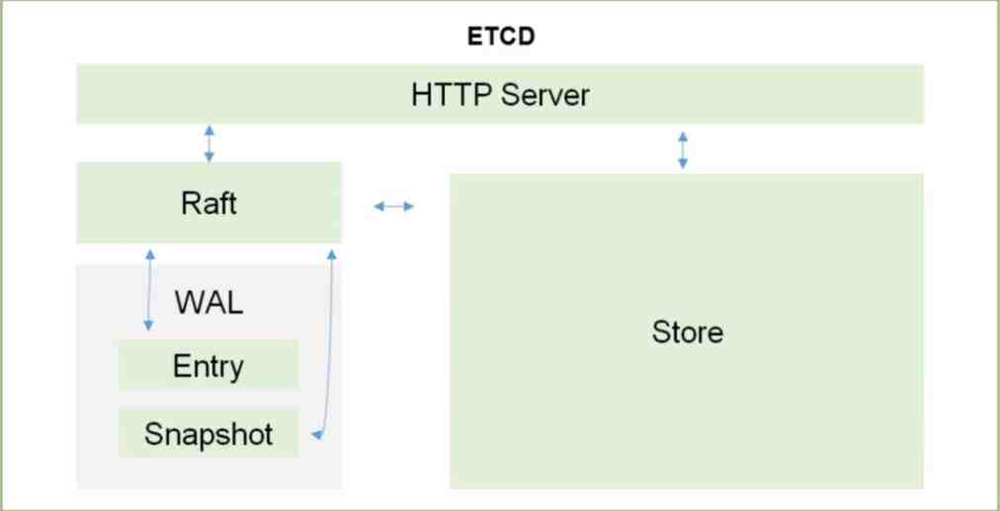

[toc]

# ETCD

```tex
etcd 可信赖的分布式键值存储服务，能够为整个分布式集群存储一些关键数据，协助分布式集群的正常运转
```

- 可信赖：天生支持集群，不需要借助其他组建
- 保存整个集群需要持久化的配置文件、配置信息，主要用于恢复数据
- v2版本，数据存储在内存中，在Kubernetes v1.11弃用
- v3版本，引入本地卷的持久化操作，关机后可以从本地磁盘恢复
- 架构图