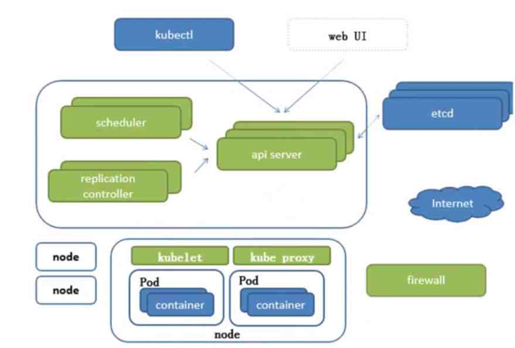

[toc]
# Kubernetes
```text
go语言，根据 google 10年容器化基础架构 borg 开发
```


## api Server

- 所有服务访问统一入口

## replication controller

- 维持副本期望数目

## scheduler

- 负责介绍任务，选择合适的节点进行分配任务

## [ETCD](ETCD.md)

- 键值对数据库，存储k8s集群所有重要信息（持久化）

## Kubelet

- 直接跟容器引擎交互实现容器的生命周期管理

## Kube proxy

- 负责写入规则至IPTABLES、IPVS实现服务映射访问

## CoreDNS

- 可以为集群中的SVC创建一个域名IP的对应关系解析

## Dashboard

- 给K8s集群提供一个B/S架构访问体系

## Ingress Controller

- 官方只能实现四层代理，Ingress可以实现七层代理

## Federation

- 提供一个可以跨集群中心多K8s统一管理功能

## Prometheus

- 提供K8s集群的监控能力

## ELK

- 提供k8s集群日志统一分析介入平台

## 注意

高可用集群副本数目最好是>=3的奇数

## 基础概念
### Pod
### 控制器类型
### k8s网络通讯模式
## 构建k8s集群
## 资源清单 yaml
### 资源
### 资源清单语法
### 编写pod
### 资源生命周期
## Pod控制器：掌握各种控制器的特点以及使用定义方式
## Service：服务发现 ，SVC原理 及其构建方式
## 服务分类
### 有状态服务:DBMS
### 无状态服务:LVS APACHE (Docker 更适合)
## 存储：掌握多种存储类型的特点，并且能够在不同环境中选择合适的存储方案的存储方案
## 调度器：调度器原理，根据要求把pod定义到想要的节点运行
## 安全：集群的认证、鉴权、访问控制、原理及流程
## HELM：类似包管理工具，掌握HELM原理，HELM模板自定义，HELM部署一些常用插件
## 运维：修改kubeadm达到证书可用期限为10年，能够构建高可用的Kubernetes集群