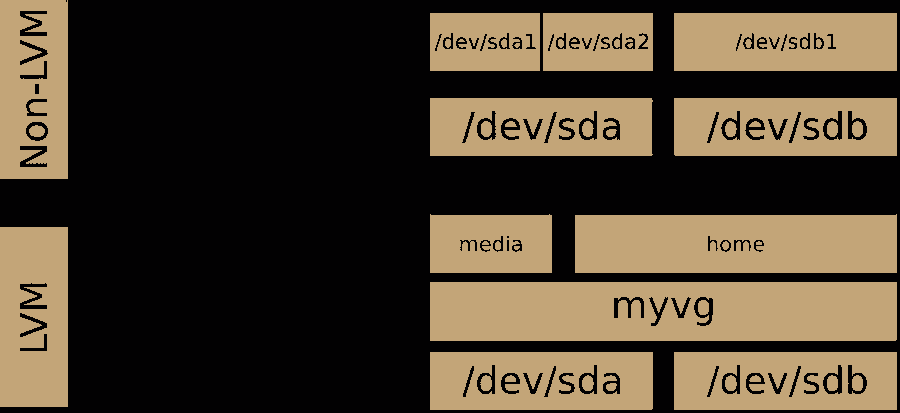

<div style="text-align: center;font-size: 40px;">Logical Volume Manager (LVM) </div>

## 

> LVM
> > https://wiki.archlinux.org/title/LVM#Logical_volumes \
> > https://wiki.archlinux.org/title/Install_Arch_Linux_on_LVM
>
> btrfs
> > https://btrfs.wiki.kernel.org/index.php/Main_Page
> > https://wiki.archlinux.org/title/Btrfs


## archlinux

```shell
pacman -S lvm2
```

## Micro OS

### command

```shell
# 新建
pvcreate /dev/sdb
pvs/pvdisplay
vgcreate lvm /dev/sdb
vgs/vgdisplay
lvcreate -l +100%FREE lvm -n six
lvs/lvdisplay
# 格式化为 btrfs 文件格式 MicroOS 默认 btrfs
mkfs.btrfs /dev/lvm/six 
mount /dev/lvm/six /home/six
# 扩展
pvcreate /dev/sdc /dev/sdd
vgextend lvm /dev/sdd /dev/sdc
# --resizefs 必加 否则 df -hT 内 Size 未变
# Filesystem          Type      Size  Used Avail Use% Mounted on
# /dev/mapper/lvm-six btrfs     6.0G  3.6M  5.8G   1% /home/six
lvextend -l +100%FREE --resizefs /dev/lvm/six
# 删除
umount /home/six
lvremove lvm/six
vgremove lvm
pvremove /dev/sdd /dev/sdb /dev/sdc
```


### virtualbox Micro OS 实操记录（openSUSE-Kubic-DVD-x86_64-Current.iso）

#### 新建

```shell
localhost:/home # pvcreate /dev/sdb
  Physical volume "/dev/sdb" successfully created.
localhost:/home # pvs
  PV         VG  Fmt  Attr PSize PFree
  /dev/sdb   lvm lvm2 a--  2.00g 2.00g  
localhost:/home # vgcreate lvm /dev/sdb
  Volume group "lvm" successfully created
localhost:/home # vgs
  VG  #PV #LV #SN Attr   VSize VFree
  lvm   1   0   0 wz--n- 2.00g 2.00g
localhost:/home # lvcreate -l +100%FREE lvm -n six
WARNING: btrfs signature detected on /dev/lvm/six at offset 65600. Wipe it? [y/n]: y
  Wiping btrfs signature on /dev/lvm/six.
  Logical volume "six" created.
localhost:/home # lvs
  LV   VG  Attr       LSize Pool Origin Data%  Meta%  Move Log Cpy%Sync Convert
  six  lvm -wi-a----- 2.00g                                                    
localhost:/home # lsblk
NAME      MAJ:MIN RM  SIZE RO TYPE MOUNTPOINT
sda         8:0    0   20G  0 disk 
├─sda1      8:1    0    8M  0 part 
├─sda2      8:2    0  8.3G  0 part /boot/writable
└─sda3      8:3    0 11.7G  0 part /var
sdb         8:16   0    2G  0 disk 
└─lvm-six 254:0    0    2G  0 lvm  
sdc         8:32   0    2G  0 disk 
sdd         8:48   0    2G  0 disk 
sr0        11:0    1  1.8G  0 rom  
localhost:/home # df -hT
Filesystem          Type      Size  Used Avail Use% Mounted on
devtmpfs            devtmpfs  471M     0  471M   0% /dev
tmpfs               tmpfs     482M     0  482M   0% /dev/shm
tmpfs               tmpfs     193M  3.2M  190M   2% /run
/dev/sda2           btrfs     8.4G  1.4G  6.5G  18% /
/dev/sda2           btrfs     8.4G  1.4G  6.5G  18% /root
/dev/sda3           btrfs      12G   90M   12G   1% /var
overlay             overlay    12G   90M   12G   1% /etc
tmpfs               tmpfs     482M     0  482M   0% /tmp
/dev/sda2           btrfs     8.4G  1.4G  6.5G  18% /.snapshots
/dev/sda2           btrfs     8.4G  1.4G  6.5G  18% /boot/grub2/x86_64-efi
/dev/sda2           btrfs     8.4G  1.4G  6.5G  18% /opt
/dev/sda2           btrfs     8.4G  1.4G  6.5G  18% /boot/grub2/i386-pc
/dev/sda2           btrfs     8.4G  1.4G  6.5G  18% /usr/local
/dev/sda2           btrfs     8.4G  1.4G  6.5G  18% /srv
/dev/sda2           btrfs     8.4G  1.4G  6.5G  18% /home
/dev/sda2           btrfs     8.4G  1.4G  6.5G  18% /boot/writable
localhost:/home # mkfs.
mkfs.bfs     mkfs.btrfs   mkfs.cramfs  mkfs.fat     mkfs.minix   mkfs.msdos   mkfs.vfat    
localhost:/home # mkfs.btrfs /dev/lvm/six 
btrfs-progs v5.14.1 
See http://btrfs.wiki.kernel.org for more information.

Label:              (null)
UUID:               31a87e89-d900-4861-8068-1c30fb3b088c
Node size:          16384
Sector size:        4096
Filesystem size:    2.00GiB
Block group profiles:
  Data:             single            8.00MiB
  Metadata:         DUP             102.19MiB
  System:           DUP               8.00MiB
SSD detected:       no
Zoned device:       no
Incompat features:  extref, skinny-metadata
Runtime features:   
Checksum:           crc32c
Number of devices:  1
Devices:
   ID        SIZE  PATH
    1     2.00GiB  /dev/lvm/six
    
localhost:/home # mkdir -p /home/six
localhost:/home # mount /dev/lvm/six /home/six
localhost:/home # lsblk
NAME      MAJ:MIN RM  SIZE RO TYPE MOUNTPOINT
sda         8:0    0   20G  0 disk 
├─sda1      8:1    0    8M  0 part 
├─sda2      8:2    0  8.3G  0 part /boot/writable
└─sda3      8:3    0 11.7G  0 part /var
sdb         8:16   0    2G  0 disk 
└─lvm-six 254:0    0    2G  0 lvm  /home/six
sdc         8:32   0    2G  0 disk 
sdd         8:48   0    2G  0 disk 
sr0        11:0    1  1.8G  0 rom  
localhost:/home # df -hT
Filesystem          Type      Size  Used Avail Use% Mounted on
devtmpfs            devtmpfs  471M     0  471M   0% /dev
tmpfs               tmpfs     482M     0  482M   0% /dev/shm
tmpfs               tmpfs     193M  3.2M  190M   2% /run
/dev/sda2           btrfs     8.4G  1.4G  6.5G  18% /
/dev/sda2           btrfs     8.4G  1.4G  6.5G  18% /root
/dev/sda3           btrfs      12G   90M   12G   1% /var
overlay             overlay    12G   90M   12G   1% /etc
tmpfs               tmpfs     482M     0  482M   0% /tmp
/dev/sda2           btrfs     8.4G  1.4G  6.5G  18% /.snapshots
/dev/sda2           btrfs     8.4G  1.4G  6.5G  18% /boot/grub2/x86_64-efi
/dev/sda2           btrfs     8.4G  1.4G  6.5G  18% /opt
/dev/sda2           btrfs     8.4G  1.4G  6.5G  18% /boot/grub2/i386-pc
/dev/sda2           btrfs     8.4G  1.4G  6.5G  18% /usr/local
/dev/sda2           btrfs     8.4G  1.4G  6.5G  18% /srv
/dev/sda2           btrfs     8.4G  1.4G  6.5G  18% /home
/dev/sda2           btrfs     8.4G  1.4G  6.5G  18% /boot/writable
/dev/mapper/lvm-six btrfs     2.0G  3.5M  1.8G   1% /home/six

```


#### 扩展

```shell
localhost:/home # lsblk
NAME      MAJ:MIN RM  SIZE RO TYPE MOUNTPOINT
sda         8:0    0   20G  0 disk 
├─sda1      8:1    0    8M  0 part 
├─sda2      8:2    0  8.3G  0 part /boot/writable
└─sda3      8:3    0 11.7G  0 part /var
sdb         8:16   0    2G  0 disk 
└─lvm-six 254:0    0    2G  0 lvm  /home/six
sdc         8:32   0    2G  0 disk 
sdd         8:48   0    2G  0 disk 
sr0        11:0    1  1.8G  0 rom   
localhost:/home # pvcreate /dev/sdc /dev/sdd
  Physical volume "/dev/sdc" successfully created.
  Physical volume "/dev/sdd" successfully created.
localhost:/home # pvs
  PV         VG  Fmt  Attr PSize PFree
  /dev/sdb   lvm lvm2 a--  2.00g    0 
  /dev/sdc   lvm lvm2 a--  2.00g 2.00g
  /dev/sdd   lvm lvm2 a--  2.00g 2.00g
localhost:/home # vgextend lvm /dev/sdd /dev/sdc
  Volume group "lvm" successfully extended  
localhost:/home # vgs
  VG  #PV #LV #SN Attr   VSize VFree
  lvm   3   1   0 wz--n- 5.99g 3.99g
localhost:/home # lvextend -l +100%FREE --resizefs /dev/lvm/six 
  Size of logical volume lvm/six changed from 2.00 GiB (511 extents) to 5.99 GiB (1533 extents).
  Logical volume lvm/six successfully resized.
Resize device id 1 (/dev/mapper/lvm-six) from 2.00GiB to 5.99GiB
localhost:/home # lvs
  LV   VG  Attr       LSize Pool Origin Data%  Meta%  Move Log Cpy%Sync Convert
  six  lvm -wi-ao---- 5.99g                                                    
localhost:/home # vgs
  VG  #PV #LV #SN Attr   VSize VFree
  lvm   3   1   0 wz--n- 5.99g    0 
localhost:/home # df -hT
Filesystem          Type      Size  Used Avail Use% Mounted on
devtmpfs            devtmpfs  471M     0  471M   0% /dev
tmpfs               tmpfs     482M     0  482M   0% /dev/shm
tmpfs               tmpfs     193M  3.2M  190M   2% /run
/dev/sda2           btrfs     8.4G  1.4G  6.5G  18% /
/dev/sda2           btrfs     8.4G  1.4G  6.5G  18% /root
/dev/sda3           btrfs      12G   90M   12G   1% /var
overlay             overlay    12G   90M   12G   1% /etc
tmpfs               tmpfs     482M     0  482M   0% /tmp
/dev/sda2           btrfs     8.4G  1.4G  6.5G  18% /.snapshots
/dev/sda2           btrfs     8.4G  1.4G  6.5G  18% /boot/grub2/x86_64-efi
/dev/sda2           btrfs     8.4G  1.4G  6.5G  18% /opt
/dev/sda2           btrfs     8.4G  1.4G  6.5G  18% /boot/grub2/i386-pc
/dev/sda2           btrfs     8.4G  1.4G  6.5G  18% /usr/local
/dev/sda2           btrfs     8.4G  1.4G  6.5G  18% /srv
/dev/sda2           btrfs     8.4G  1.4G  6.5G  18% /home
/dev/sda2           btrfs     8.4G  1.4G  6.5G  18% /boot/writable
/dev/mapper/lvm-six btrfs     6.0G  3.6M  5.8G   1% /home/six
```

#### 删除

```shell
localhost:/home # lsblk
NAME      MAJ:MIN RM  SIZE RO TYPE MOUNTPOINT
sda         8:0    0   20G  0 disk 
├─sda1      8:1    0    8M  0 part 
├─sda2      8:2    0  8.3G  0 part /boot/writable
└─sda3      8:3    0 11.7G  0 part /var
sdb         8:16   0    2G  0 disk 
└─lvm-six 254:0    0    6G  0 lvm  /home/six
sdc         8:32   0    2G  0 disk 
└─lvm-six 254:0    0    6G  0 lvm  /home/six
sdd         8:48   0    2G  0 disk 
└─lvm-six 254:0    0    6G  0 lvm  /home/six
sr0        11:0    1  1.8G  0 rom  
localhost:/home # umount /home/six
localhost:/home # lvremove lvm/six
Do you really want to remove and DISCARD active logical volume lvm/six? [y/n]: y
  Logical volume "six" successfully removed.
localhost:/home # vgremove lvm
  Volume group "lvm" successfully removed
localhost:/home # pvs
  PV         VG Fmt  Attr PSize PFree
  /dev/sdb      lvm2 ---  2.00g 2.00g
  /dev/sdc      lvm2 ---  2.00g 2.00g
  /dev/sdd      lvm2 ---  2.00g 2.00g
localhost:/home # pvremove /dev/sdd /dev/sdb /dev/sdc
  Labels on physical volume "/dev/sdd" successfully wiped.
  Labels on physical volume "/dev/sdb" successfully wiped.
  Labels on physical volume "/dev/sdc" successfully wiped.
```