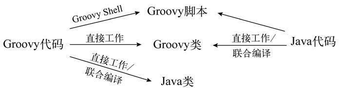
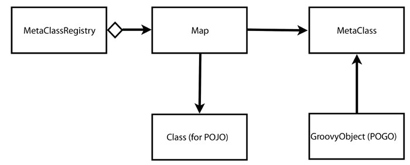
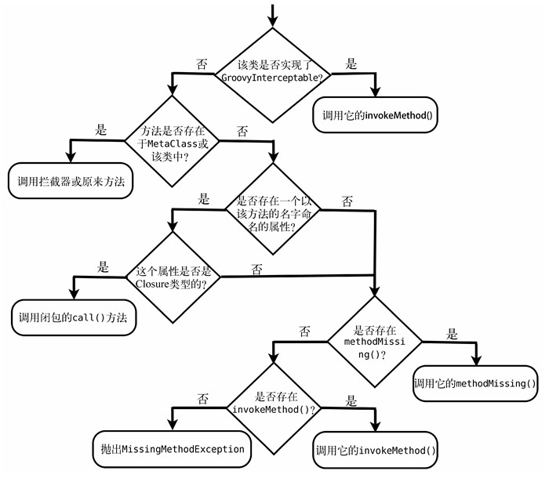

## Groovy 自动导入的包

- java.lang
- java.util
- java.io
- java.net
- java.math.BigDecimal
- java.math.BigInteger
- groovy.lang
- groovy.util

## chapter02

1. `return`语句几乎总是可选的
2. 尽管可以使用分号分隔语句,但它几乎总是可选的
3. 方法和类默认是`public`的
4. `?.`操作符只有对象引用不为空时才会分派调用
    1. [Ease.groovy](src/main/groovy/org/bougainvilleas/ilg/study/chapter02/Ease.groovy)
5. 可以使用具名参数初始化`JavaBean`
6. `Groovy`不强迫我们捕获自己不关心的异常,这些异常会被传递给代码的调用者
    1. [ExceptionHandling.groovy](src/main/groovy/org/bougainvilleas/ilg/study/chapter02/ExceptionHandling.groovy)
7. `静态方法`内可以使用`this`来引用`CLass`对象
    1. [Wizard.groovy](src/main/groovy/org/bougainvilleas/ilg/study/chapter02/Wizard.groovy)

### JavaBean

> groovy 自动创建 getter setter\
> groovy 默认public 且不区分 public private protected\
> `groovyc` 会忽略 `@Override`

### boolean

|类型|为true条件|
|:---|:---|
|Boolean|值为true|
|Collection|集合不为空|
|Character|值不为0|
|CharSequence|长度大于0|
|Enumeration|hasMoreElements() 为 true|
|Iterator|hasNext() 为true|
|Number|Double值不为0|
|Map|该映射不为空|
|Matcher|至少有一个匹配|
|Object[]|长度大于0|
|其他任何类型|引用不为null|

### 注意

> groovy ==
> > Groovy 的 == 映射到 equals() 方法 \
> > 当实现 Comparable 接口时 会将 == 映射到 compareTo() 方法 \
> > groovy 的 is() 是 比较 内存地址
>
> 类型检查默认关闭
> > groovy 中 x=y 在语义上等价于 x=(ClassOfx)y 强制类型转换 \
> > groovy编译器不会验证类型,只是进行强制类型转换,然后将其留给运行时处理 可能出现 GroovyCastException 异常 \
> > 通过 javap -c CLassFileName 分析字节码验证上述内容 \
> > 如果调用一个不存在的方法,也不会出现编译错误,运行时会出现 MissingMethodException \
> > 利用上诉内容,可以在代码编译时和执行时动态注入缺失的方法


> groovy 方法内不能有任何代码块 如下
> > java的代码块,groovy编译器会错误地认为要定义一个闭包,并给出编译错误

```jshelllanguage
public void method()
{
    System.out.println("hello");
    //groovy编译器会错误地认为 下面的代码块 是要定义一个闭包,并给出编译错误
    {
        System.out.println("hello");
    }
}
```


### groovy 新关键字

> `def` 用于定义方法,属性,局部变量
>
> `in` 用于在for循环中指定循环的区间
>
> `it` 虽然不是关键字,但是 闭包内默认使用此变量名

## chapter03 动态类型(groovy属于强类型语言)

> 动态类型语言中的类型是在**运行时**推断的 \
> 方法及其实参也是在运行时检查 \
> 通过这种能力可以在运行时向类中注入行为,从而使代码比严格的静态类型具有更好的扩展性
> > 借助动态类型,可以用比Java更少的代码创建灵活的设计 \
> > 将实参的类型验证推迟到**运行时**这一特性为Groovy中的多态注入了活力 \
> > 利用**多方法**(multimethods)这一工具,可以为与实参的运行时类型相关的操作提供替换行为

 
## java 和 groovy 混合



> 在groovy代码中使用groovy类，无需额外操作，直接可以工作
> > 需要确保所依赖的类在类路径 classpath 下；是字节码、源代码
> 
> java类中使用groovy脚本
> > JSR 223 提供的 ScriptEngine API
> 
> Java中使用groovy类 或者 groovy中使用java类
> > 利用groovy 联合编译工具（joint-compilation）


## Groovy 对象

> 带有附加功能的Java对象 \
> Groovy使用的三类对象：
> > POJO (plain old java object 普通java对象)扩展了java.lang.Object\
> > POGO (plain old groovy object 普通groovy对象) 扩展了java.lang.Object 同时实现了groovy.lang.GroovyObject \
> > Groovy 拦截器，扩展了 GroovyInterceptable 的groovy对象，具有方法拦截功能

### Groovy 源代码 GroovyObject

> invokeMethod()、getProperty()、setProperty()使Java对象具有高度动态性，可以使用他们来处理运行中创建的方法和属性 \
> getMetaClass()、setMetaClass() 使创建代理拦截POGO上的方法调用、在POGO上注入方法变得非常容易 \
> 一旦一个类被加载到JVM中，就不能修改它的元对象Class，可以通过setMetaClass() 修改它的MetaClass，好像对象在运行时修改了它的类

```groovy
package groovy.lang;

import groovy.transform.Internal;

public interface GroovyObject {

    /**
     * Invokes the given method.
     *
     * @param name the name of the method to call
     * @param args the arguments to use for the method call
     * @return the result of invoking the method
     */
    @Internal // marked as internal just for backward compatibility, e.g. AbstractCallSite.createGroovyObjectGetPropertySite will check `isMarkedInternal`
    default Object invokeMethod(String name, Object args) {
        return getMetaClass().invokeMethod(this, name, args);
    }

    /**
     * Retrieves a property value.
     *
     * @param propertyName the name of the property of interest
     * @return the given property
     */
    @Internal // marked as internal just for backward compatibility, e.g. AbstractCallSite.createGroovyObjectGetPropertySite will check `isMarkedInternal`
    default Object getProperty(String propertyName) {
        return getMetaClass().getProperty(this, propertyName);
    }

    /**
     * Sets the given property to the new value.
     *
     * @param propertyName the name of the property of interest
     * @param newValue     the new value for the property
     */
    @Internal // marked as internal just for backward compatibility, e.g. AbstractCallSite.createGroovyObjectGetPropertySite will check `isMarkedInternal`
    default void setProperty(String propertyName, Object newValue) {
        getMetaClass().setProperty(this, propertyName, newValue);
    }

    /**
     * Returns the metaclass for a given class.
     *
     * @return the metaClass of this instance
     */
    MetaClass getMetaClass();

    /**
     * Allows the MetaClass to be replaced with a derived implementation.
     *
     * @param metaClass the new metaclass
     */
    void setMetaClass(MetaClass metaClass);
}

```

### Groovy 源代码 GroovyInterceptable

> 扩展了GroovyObject的标记接口，对于实现了该接口的对象而言，其上所有方法调用，不管是否存在，都会被invokeMethod() 方法拦截

```groovy
package groovy.lang;

/**
 * Marker interface used to notify that all methods should be intercepted through the <code>invokeMethod</code> mechanism
 * of <code>GroovyObject</code>.
 */
public interface GroovyInterceptable extends GroovyObject {
}
```

## Groovy 支持对POJO和POGO进行元编程 

> 当调用一个方法时Groovy会检查目标对象时一个POJO还是POGO，不同类型，groovy方法处理不同 \
> 对于POJO Groovy 维护了MetaClass的一个 MetaClassRegistry
> > 调用方法时，Groovy 会去应用类的 MetaClassRegistry 取它的MetaClass，将方法调用委托给它\
> > 因此在它的MetaClass上定义的任何拦截器或方法，都优先于 POJO原来的方法
>
> 对于POGO POGO有一个到其MetaClass的直接引用



> POGO 调用方法时，groovy 会采取一些额外的步骤，如下图：
> > 如果对象实现了GroovyInterceptable,那么所有的调用都会被路由到它的invokeMethod(),在此拦截器内，可以再把调用路由给实际的方法，使类AOP的操作成为可能 \
> > 如果对象未实现GroovyInterceptable,会先查找其MetaClass中的方法
> > > 如果没有则查找POGO自身上的方法，如果该POGO没有这样的方法，Groovy会以方法名查找属性或字段 \
> > > 如果属性或字段使Closure类型的（闭包），Groovy会调用它，代替方法调用 \
> > >如果没有找到这样的属性或字段，会做最后两次尝试
> > > >如果POGO有一个名为methodMissing()的方法，则调用该方法 \
> > > >否则调用POGO的invokeMethod()
> > > > >如果POGO实现了invokeMethod(),会被调用 \
> > > > >invokeMethod()默认实现会抛出 MissingMethodException异常，说明调用失败



## MetaClass

> groovy.lang.ExpandoMetaClass 是 MetaClass 接口的众多不同实现之一 \
> 默认情况下 groovy 目前并没有使用 groovy.lang.ExpandoMetaClass \
> 当我们向 metaClass 添加一个方法时，默认的 metaClass 会被用一个 groovy.lang.ExpandoMetaClass 实例替换掉 \
> [eg](src/main/groovy/org/bougainvilleas/ilg/study/chapter12/MetaClassUsed.groovy)