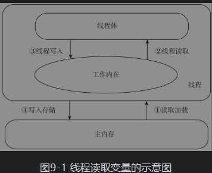
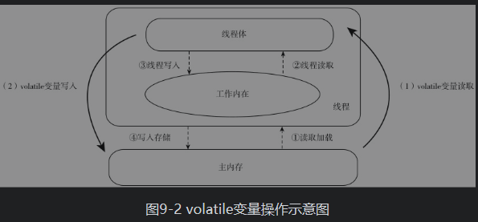

# JAVA 基础
##《改善Java程序的151个建议》
### Chapter01:Java开发中通用的方法和准则
    1. Aa不要在常量和变量中出现易混淆的字母
    2. Ab莫让常量蜕变成变量
    3. Ac三元操作符的类型务必一致
    4. Ad避免带有变长参数的方法重载
    5. Ae别让null值和空值威胁到变长方法
    6. Af覆写变长方法也循规蹈矩
    7. Ag警惕自增的陷阱
    8. Ah不要让旧语法困扰你
    9. Ai少用静态导入
    10. Aj不要在本类中覆盖静态导入的变量和方法
    11. Ak养成良好习惯，显式声明UID
    12. Al避免用序列化类在构造函数中为不变量赋值
    13. Am避免为final变量复杂赋值
    14. An使用序列化类的私有方法巧妙解决部分属性持久化问题
    15. Ao break万万不可忘
    16. Ap易变业务使用脚本语言编写
    17. Aq慎用动态编译
    18. Ar避免instanceof非预期结果
    19. As断言绝对不是鸡肋
    20. At不要只替换一个类
### Chapter02：基本类型
    21. Au用偶判断，不用奇判断
    22. Av用整数类型处理货币
    23. Aw不要让类型默默转换
    24. Ax边界，边界，还是边界
    25. Ay不要让四舍五入亏了一方
    26. Az提防包装类型的null值
    27. Ba谨慎包装类型的大小比较
    28. Bb优先使用整型池
    29. Bc优先选择基本类型
    30. Bd不要随便设置随机种子
### Chapter03：对象及方法
    31. Be在接口中不要存在实现代码
    32. Bf静态变量一定要先声明后赋值
    33. Bg不要覆写静态方法
    34. Bh构造函数尽量简化
    35. Bi避免在构造函数中初始化其他类
    36. Bj使用构造代码块精炼程序
    37. Bk构造代码块会想你所想
    38. Bl使用静态内部类提高封装性
    39. Bm使用匿名类的构造函数
    40. Bn匿名类的构造函数很特殊
    41. Bo让多重继承成为现实
    42. Bp让工具类不可实例化
    43. Bq避免对象的浅拷贝
    44. Br推荐使用序列化实现对象的拷贝
    45. Bs覆写equals方法时不要识别不出自己
    46. Bt equals应该考虑null值情景
    47. Bu在equals中使用getClass进行类型判断
    48. Bv覆写equals方法必须覆写hashCode方法
    49. Bw推荐覆写toString方法
    50. Bx使用package-info类为包服务
    51. By不要主动进行垃圾回收
### Chapter04：字符串
    52. Bz推荐使用String直接量赋值
    53. Ca注意方法中传递的参数要求
    54. Cb正确使用String、StringBuffer、StringBuilder
    55. Cc注意字符串的位置
    56. Cd自由选择字符串拼接方法
    57. Ce推荐在复杂字符串操作中使用正则表达式
    58. Cf强烈建议使用UTF编码
    59. Cg对字符串排序持一种宽容的心态
### Chapter05：数组和集合
    60. Ch性能考虑，数组是首选
    61. Ci若有必要，使用变长数组
    62. Cj警惕数组的浅拷贝
    63. Ck在明确的场景下，为集合指定初始容量
    64. Cl多种最值算法，适时选择
    65. Cm避开基本类型数组转换列表陷阱
    66. Cn asList方法产生的List对象不可更改
    67. Co不同的列表选择不同的遍历方法
    68. Cp频繁插入和删除时使用LinkedList
    69. Cq列表相等只需关心元素数据
    70. Cr子列表只是原列表的一个视图
    71. Cs推荐使用subList处理局部列表
    72. Ct生成子列表后不要再操作原列表
    73. Cu使用Comparator进行排序
    74. Cv不推荐使用binarySearch对列表进行检索
    75. Cw集合中的元素必须做到compareTo和equals同步
    76. Cx集合运算时使用更优雅的方式
    77. Cy使用shuffle打乱列表
    78. Cz减少HashMap中元素的数量
    79. Da集合中的哈希码不要重复
    80. Db多线程使用Vector或HashTable
    81. Dc非稳定排序推荐使用List
    82. Dd由点及面，一叶知秋—集合大家族
### Chapter06：枚举和注解
    83. De推荐使用枚举定义常量
    84. Df使用构造函数协助描述枚举项
    85. Dg小心switch带来的空值异常
    86. Dh在switch的default代码块中增加AssertionError错误
    87. Di使用valueOf前必须进行校验
    88. Dj用枚举实现工厂方法模式更简洁
    89. Dk枚举项的数量限制在64个以内
    90. Dl小心注解继承
    91. Dm枚举和注解结合使用威力更大
    92. Dn注意@Override不同版本的区别
### Chapter07：泛型和反射
    93. Do Java的泛型是类型擦除的
    94. Dp不能初始化泛型参数和数组
    95. Dq强制声明泛型的实际类型
    96. Dr不同的场景使用不同的泛型通配符
    97. Ds警惕泛型是不能协变和逆变的
    98. Dt建议采用的顺序是List<T>、List<?>、List<Object>
    99. Du严格限定泛型类型采用多重界限
    100. Dv数组的真实类型必须是泛型类型的子类型
    101. Dw注意Class类的特殊性
    102. Dx适时选择getDeclared×××和get×××
    103. Dy反射访问属性或方法时将Accessible设置为true
    104. Dz使用forName动态加载类文件
    105. Ea动态加载不适合数组
    106. Eb动态代理可以使代理模式更加灵活
    107. Ec使用反射增加装饰模式的普适性
    108. Ed反射让模板方法模式更强大
    109. Ee不需要太多关注反射效率
### Chapter08：异常
    110. Ef提倡异常封装
    111. Eg采用异常链传递异常
    112. Eh受检异常尽可能转化为非受检异常
    113. Ei不要在finally块中处理返回值
    114. Ej不要在构造函数中抛出异常
    115. Ek使用Throwable获得栈信息
    116. El异常只为异常服务
    117. Em多使用异常，把性能问题放一边
### Chapter09：多线程和并发
    118. En不推荐覆写start方法
    119. Eo启动线程前stop方法是不可靠的
    120. Ep不使用stop方法停止线程
    121. Eq线程优先级只使用三个等级
    122. Er使用线程异常处理器提升系统可靠性
    123. Es volatile不能保证数据同步
    124. Et异步运算考虑使用Callable接口
    125. Eu优先选择线程池
    126. Ev适时选择不同的线程池来实现
    127. EwLock与synchronized是不一样的
    128. Ex预防线程死锁
    129. Ey适当设置阻塞队列长度
    130. Ez使用CountDownLatch协调子线程
    131. Fa CyclicBarrier让多线程齐步走
### Chapter10：性能和效率
    132. Fb提升Java性能的基本方法
    133. Fc若非必要，不要克隆对象
    134. Fd推荐使用“望闻问切”的方式诊断性能
    135. Ff必须定义性能衡量标准
    136. Fg枪打出头鸟—解决首要系统性能问题
    137. Fh调整JVM参数以提升性能
    138. Fi性能是个大“咕咚”
### Chapter11：开源世界
    139. Fj大胆采用开源工具
    140. Fk推荐使用Guava扩展工具包
    141. Fl Apache扩展包
    142. Fm推荐使用Joda日期时间扩展包
    143. Fn可以选择多种Collections扩展
### Chapter12：思想为源
    144. Fo提倡良好的代码风格
    145. Fp不要完全依靠单元测试来发现问题
    146. Fq让注释正确、清晰、简洁
    147. Fr让接口的职责保持单一
    148. Fs增强类的可替换性
    149. Ft依赖抽象而不是实现
    150. Fu抛弃7条不良的编码习惯
    151. Fv以技术员自律而不是工人
##《改善Java程序的151个建议》笔记
1. 包名全小写、类名首字母全大写、常量全部大写并用下划线分隔、变量采用驼峰命名法（Camel Case）;
2. 不要将易混字母混合使用iIlL10Oo(小写字母i、大写字母I、小写字母l、大写字母L、数字1、数字0、大写字母O、小写字母o)
1. 在面向对象编程（Object-Oriented Programming，OOP）的世界里，类和对象是真实世界的描述工具，方法是行为和动作的展示形式，封装、继承、多态则是其多姿多彩的主要实现方式
1. 枚举和注解都是在Java 1.5中引入的。枚举改变了常量的声明方式;注解耦合了数据和代码.
1. Java从1.5版开始引入了注解（Annotation），其目的是在不影响代码语义的情况下增强代码的可读性，并且不改变代码的执行逻辑，对于注解始终有两派争论，正方认为注解有益于数据与代码的耦合，“在有代码的周边集合数据”；反方认为注解把代码和数据混淆在一起，增加了代码的易变性，削弱了程序的健壮性和稳定性
1. 泛型可以减少强制类型的转换，可以规范集合的元素类型，还可以提高代码的安全性和可读性，正是因为有这些优点，自从Java引入泛型后，项目的编码规则上便多了一条：优先使用泛型
1. 反射可以“看透”程序的运行情况，可以让我们在运行期知晓一个类或实例的运行状况，可以动态地加载和调用，虽然有一定的性能忧患，但它带给我们的便利远远大于其性能缺陷
1. java内存模型-线程读取变量示意图
1. java内存模型-volatile变量操作示意图
##枚举
```text
枚举的每一项，都相当于是枚举类的子类
```
## 建议使用UTF编码
### java文件编码
```text
使用记事本创建.java后缀的文件，则文件的编码格式就是操作系统默认的格式。
如果是使用IDE工具创建的，则依赖于IDE的设置
```
### class文件编码
```text
通过javac命令生成的.class字节码文件是UTF-8编码的UNICODE文件,与操作系统无关
UTF是UNICODE的存储和传输格式，是为了解决UNICODE的高位占用冗余空间而产生的
使用UTF编码就标志着字符集使用的是UNICODE
```
### javac
- 不指定encoding 默认使用系统的编码，windows=GBK，java文件编码格式最好与encoding指定的一致，否则class文件里的中文是乱码
```shell script
javac -encoding GBK GBKCode.java
```
### javap 
- 读class文件，有点像反编译，但是不够完整 可以借助IDEA阅读
```shell script
javap GBKCode
```
