# 数据结构与算法 Data Structure and Algorithms

## 稀疏数组

> 当一个数组中大部分元素是同一值,可以使用稀疏数组来保存该数组
> 
> 处理方法
> > 记录数组一共有几行几列,有多少个不同的值 \
> > 把具有不同值的元素的行列及值记录在一个小规模的数组中,从而缩小程序的规模

## tree

## MultiwayTree 多叉树

> 必须是有序的，中序遍历会按从小到大输出 \
> 多叉树通过重新组织结点，减少树的高度，对二叉树进行优化 
>
> 二叉树存在的问题 
> > 二叉树需要加载到内存，如果二叉树节点少，没有问题 \
> > 如果二叉树结点很多（1亿）会有如下问题
> > > 在构建二叉树时，需要多次进行I/O操作（可能是查询数据库，也可能是读取文件），即海量结点，会影响构建二叉树的速度 \
> > > 结点海量，二叉树的高度很大，降低操作速度，递归次数很大
> 
> 在二叉树中每个结点有数据項，最多有两个子结点 \
> 当每个结点可以有更多的数据項和更多的子结点，就是多叉树 \
> 如：2-3树、2-3-4树、BTree、B+Tree、B*Tree

## BTree BalanceTree

> 介绍
> > BTree,B树，BalanceTree，B-Tree（不是B减树，是个横杠，起连接作用）\
> > B树通过重新组织结点，降低树的高度，并且减少I/O次数来提升效率 \
> > 文件系统以及数据库系统的设计者理由磁盘预读原理，将一个结点的大小设为等于一个页（页大小通常为4k），这样每个结点只需要一次I/O就可以完全载入 \
> > 将树的度M设置为1024,在600亿个元素中最多只需要4次I/O操作就可以读取到想要的元素 \
> > BTree广泛应用于文件存储系统以及数据库系统

### BTree说明

> B树的阶：结点的 最多 子结点 个数。2-3树的阶是3,2-3-4的阶是4 \
> B树的搜索，从根结点开始，对结点内的关键字（有序）序列进行二分查找，如果命中则结束，否则进入查询关键字所属范围的儿子结点;重复，直到所对应的儿子指针为空，或已经是叶子结点 \
> 关键字集合分布在整棵树中，即叶子结点和非叶子结点都存放数据。 \
> 搜索有可能在非叶子结点结束 \
> 其搜索性能等价于在关键字全集内做一次二分查找 

### B+Tree

> 说明
> > B+树的搜索与B树基本相同，其性能也等价于在关键字全集做一次二分查找 \
> > 区别
> > > B+树只有达到叶子结点才命中 \
> > > B树可以在非叶子结点命中
> >
> > 所有关键字都出现在叶子结点的链表中（数据只能在叶子结点「也叫稠密索引」）且链表中的关键字（数据）恰好是有序的 \
> > 非叶子结点相当于是叶子结点的索引（稀疏索引），叶子结点相当于存储数据（关键字）的数据层 \
> > 更适合文件索引系统 \
> > `Btree`和`B+树`各有自己的应用场景，不能说`B+树`完全比`B树`好，反之亦然

### B*Tree

> 说明
> > `B*树`是`B+树`的变体，在`B+树`的非根和非叶子结点再增加指向兄弟的指针 \
> > `B*树`定义了非叶子结点关键字个数至少为`（2/3）*M`，即块的最低使用率为三分之二，而`B+树`的块的最低使用率为`B+树`的二分之一 \
> > `B*树`分配新结点的概率比`B+树`要低，空间使用率更高 \

### 2-3树

> 介绍
> > 最简单的BTree
> > 2-3树的所有叶子结点都在同一层（BTree都需要满足这个约束条件）\
> > 2-3树是由二结点和三结点构成的树 
> >
> > 二结点：有两个子结点的节点叫二结点 
> > > 要么没有子结点 \
> > > 要么有两个子结点
> >
> > 三结点： 有三个子结点的结点叫三结点
> > > 要么没有子结点 \
> > > 要么有三个子结点

- `2-3树`创建示例图

### 扩展

> 2-3-4树与2-3树类似 \
> 2-3-4树结点的最大数据量为3位
> 
> 理解
> > 3个点可以将数轴分成4份（4结点=4个子树，当查询的数据在w=4（w=度=子结点数）的结点下时，类似4分法查询，一次能排除四分之三的数据量）\
> > 2个点可以将数轴分成3份（3个子树，当查询的数据在度为3的结点下是，类似三分法查询，一次能排除三分之二的数据量）\
> > 1个点可以将数轴分成2份（2个子树，二叉树就是这样）
