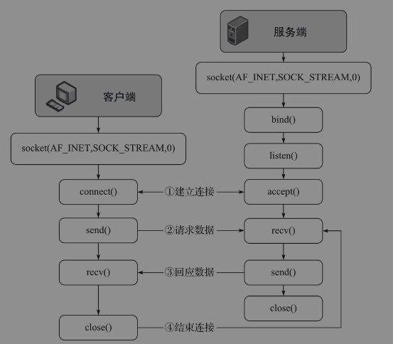

## java IO

### socket

#### 

> Socket技术可以实现不同计算机间的数据通信，从而实现在集群中的服务器之间进行数据交换 \
> Java语言开发Socket软件时，内部调用的还是基于操作系统的Socket的API \
> JDK将Socket技术进行了重量级的封装，可以用最简单的代码实现复杂的功能，API接口设计得简洁、有序，因此，即使不懂C++，也能顺利地学习Socket编程。 \
> 掌握C++语言其实是更有益于学习底层对Socket的封装，研究一些细节问题时会应用到 
> 
> Socket技术基于TCP/IP \
> Socket编程其实就是实现服务端与客户端的数据通信，不管使用任何的编程语言，在实现上基本上都是4个步骤： \
> ①建立连接；②请求连接；③回应数据；④结束连接

### NIO

#### 

> NIO相比普通的I/O提供了功能更加强大、处理数据更快的解决方案，它可以大大提高I/O（输入/输出）吞吐量，常用在高性能服务器上 \
> NIO实现高性能处理的原理是使用较少的线程来处理更多的任务 \
> 使用较少的Thread线程，通过Selector选择器来执行不同Channel通道中的任务 \
> 执行的任务再结合AIO（异步I/O）就能发挥服务器最大的性能，大大提升软件运行效率 
> 
> 常规的I/O（如InputStream和OutputStream）存在很大的缺点，就是它们是阻塞的 \
> 而NIO解决的就是常规I/O执行效率低的问题。即采用非阻塞高性能运行的方式来避免出现以前“笨拙”的同步I/O带来的低效率问题 \
> NIO在大文件操作上相比常规I/O更加优秀，对常规I/O使用的byte[]或char[]进行封装，采用ByteBuffer类来操作数据 \
> 再结合针对File或Socket技术的Channel，采用同步非阻塞技术实现高性能处理 \
> NIO技术中的核心要点：缓冲区（Buffer） \
> 缓冲区在NIO的使用中占据了很高的地位，因为数据就是存放到缓冲区中，并对数据进行处理

### Selector

- 当客户端连接时，会通过ServerSocketChannel得到SocketChannel
- selector通过select方法监听，返回事件发生的通道个数
- 将SocketChannel注册到Selector上，SelectionKey register(Selector sel, int ops),selector可以注册多个SocketChannel
- 注册后返回一个SelectionKey会和该Selector关联（set集合）
- 进而得到各个SelectionKey（有事件发生）
- 再通过SelectionKey反向获取SocketChannel,channel()方法
- 通过获取的SocketChannel进行业务处理

### Channel

- 每个Channel对应一个或多个Buffer（分散读取和聚集写入）
- Selector 对应一个线程，一个Selector对应多个Channel，进而一个线程对应多个Channel
- 程序决定切换到具体Channel是由具体事件决定，Event是一个很重要的概念
- Selector会根据不同时间，在各个channel上切换
- Buffer就是一个内存块，底层是一个数组
- 数据的读取写入是用过buffer,通过flip方法切换读取模式和写入模式，BIO中输入流输出流只能单向
- channel是双向的，可以返回底层操作系统的情况，比如linux底层的操作系统通道就是双向的

### Buffer 缓冲区 `java.nio.Buffer`

> java.nio.Buffer
> > 传统的I/O流API,InputStream和OutputStream，以及Reader和Writer联合使用时\
> > 常常把字节流中的数据放入byte[]字节数组中，或把字符流中的数据放入char[]字符数组中，也可以从byte[]或char[]数组中获取数据来实现功能上的需求
> >
> > 在Java语言中对array数组自身进行操作的API非常少，常用的操作仅仅是length属性和下标`[x]`\
> > 在JDK中也没有提供更加方便操作数组中数据的API，如果对数组中的数据进行高级处理，需要程序员自己写代码进行实现，处理的方式是比较原始的\
> > 这个问题可以使用NIO技术中的缓冲区Buffer类来解决，它提供了很多工具方法，大大提高了程序开发的效率
> >
> > Buffer类是一个抽象类，它具有7个直接子类 \
> > 缓冲区中存储的数据类型并不像普通I/O流只能存储byte或char数据类型 \
> > 抽象类`java.nio.Buffer`的7个子类是***抽象类***,不能直接new实例化\
> > 需要借助静态方法`wrap()`进行实现。`wrap()`方法的作用是将数组放入缓冲区中，来构建存储不同数据类型的缓冲区 \
> > ***缓冲区为非线程安全的***
> > > ByteBuffer\
> > > CharBuffer\
> > > DoubleBuffer\
> > > FloatBuffer\
> > > IntBuffer\
> > > LongBuffer\
> > > ShortBuffer
> >
> > 注意：
> > > 缓冲区为非线程安全的 \
> > > Buffer类没有BooleanBuffer这个子类\
> > > 类java.lang.StringBuffer是在lang包下的\
> > > 在nio包下并没有提供java.nio.StringBuffer缓冲区\
> > > 在NIO中存储字符的缓冲区可以使用CharBuffer类\
> > > NIO中的Buffer是一个用于存储基本数据类型值的容器\
> > > 它以类似于数组有序的方式来存储和组织数据\
> > > 每个基本数据类型（除去boolean）都有一个子类与之对应。

- Buffer类使用
    - 包装数据和获得容量
        - capacity（容量）
            - 包含元素的数量
            - 不能为负数
            - 不能更改
        - limit（限制）：缓冲区的限制，代表第一个不应该读取或写入元素的index
            - limit不能为负
            - limit不能大于capacity
            - 方法limit():获取此缓冲区的限制
            - 方法limit(int newLimit):设置此缓冲区的限制
        - position（位置）：代表下一个要读取或写入元素的index
            - 不能为负
            - 不能大于limit
            - 如果mark已定义且大于新的position则丢弃该mark
            - position():返回此缓冲区的位置
            - position(int newPosition):设置此缓冲区新的位置
        - remaining（剩余空间）：缓冲区剩余的空间大小，
            - remaining()：返回当前位置position与limit之间的元素个数，limit-position
        - mark（标记）:缓冲区的标记是一个索引，调用reset()方法，会将缓冲区的position重置为该索引
            - mark():在此缓冲区的位置设置标记
            - 不能为负
            - 不能大于position
            - 如果定义了mark，则在将position或limit调整为小于该mark的值时，该mark被丢弃，丢弃后的mark值是-1
            - 未定义mark，调用reset() 将导致抛出InvalidMarkException异常
    - isReadOnly():告知此缓冲区是否为只读缓冲区,七个返回值都是false
    - isDirect()：判断此缓冲区是否为直接缓冲区
        - 非直接缓冲区
        ```text
        通过ByteBuffer向硬盘存取数据时是需要将数据暂存在JVM的中间缓冲区，
        如果有频繁操作数据的情况发生，则在每次操作时都会将数据暂存在JVM的中间缓冲区，再交给ByteBuffer处理，
        这样做就大大降低软件对数据的吞吐量，提高内存占有率，造成软件运行效率降低
        ```
        - 直接缓冲区
        ```text
        直接缓冲区直接在内核空间中就进行了处理，无须JVM创建新的缓冲区，
        这样就减少了在JVM中创建中间缓冲区的步骤，增加了程序运行效率
        ```
    - clear():作用是防止读写缓冲区时越界。还原缓冲区到初始状态，源码如下
        ```text
        public final Buffer clear() {
                position = 0;
                limit = capacity;
                mark = -1;
                return this;
        }   
        ```
        - 主要使用场景: 放在准备往缓冲区写入内容之前调用此方法，clear() 方法并不会清除缓冲区数据，只是还原position，limit，mark为初始值
    - flip(): 作用是防止读写缓冲区时越界。反转此缓冲区。首先将限制设置为当前位置，然后将位置设置为0,mark设置为初始值（相当于移除标记mark）
        ```text
        public final Buffer flip() {
                limit = position;
                position = 0;
                mark = -1;
                return this;
        }  
        ```
        - 使用场景: 当向缓冲区中存储数据，然后再从缓冲区中读取数据。
    - hasArray():判断此缓冲区是否具有可访问的底层实现数组,是否有char[],int[]等数组
        ```text
        public final boolean hasArray() {
                return (hb != null) && !isReadOnly;
        }
        ```
    - hasRemaining():判断当前位置和限制之间是否有元素
    - remaining():返回当前位置与限制之间的元素个数
        ```text
        public final boolean hasRemaining() {
                return position < limit;
            }
        public final int remaining() {
                return limit - position;
            }
        ```
        - 使用场景: 读写缓冲区时使用
    - rewind():重绕缓冲区，将position设置为0 mark设置为-1,limit不变,为重新读取缓冲区的数据做准备
        ```text
         public final Buffer rewind() {
                position = 0;
                mark = -1;
                return this;
            }
        ```
        - 使用场景: 重新读取缓冲区中数据时使用
    - arrayOffset():获取偏移量，返回缓冲区的底层实现数组中第一个缓冲区元素的偏移量，这个值在文档中标注为可选操作，也就是子类可以不处理这个值
        ```text
        public final int arrayOffset() {
                if (hb == null)
                    throw new UnsupportedOperationException();
                if (isReadOnly)
                    throw new ReadOnlyBufferException();
                return offset;
            }
        ``` 
- ByteBuffer类使用 : ByteBuffer类是Buffer的子类，可以在缓冲区中以字节为单位对数据进行存取
    - 六类操作
      ```
      1. 以绝对位置和相对位置读写单个字节的get和put方法
      2. 使用相对批量get(byte[] dst)方法可以将缓冲区中的连续字节传输到byte[] dst目标数组中
      3. 使用相对批量put(byte[] src)方法可以将byte[]数组或其他字节缓冲区中的连续字节存储到此缓冲区中
      4. 使用绝对和相对getType和putType方法可以按照字节顺序在字节序列中读写其他基本数据类型的值，方法getType和putType可以进行数据类型的自动转换
      5. 提供了创建视图缓冲区的方法，这些方法允许将字节缓冲区视为包含其他基本类型的缓冲区，这些方法有asCharBuffer()、asDoubleBuffer()、asFloatBuffer()、asIntBuffer()、asLongBuffer()、asShortBuffer()
      6. 提供对字节缓冲区进行压缩(compacting)、复制(duplicating)、截取(slicing)的方法
      ```
    - 字节缓冲区可以通过allocation()方法创建，此方法为缓冲区的内容分配空间，或者通过wrapping方法将现有的byte[]数组包装到缓冲区来创建
    - 字节缓冲区
        - 直接字节缓冲区 实现类DirectByteBuffer
        ```
         JVM会尽量在直接字节缓冲区上执行本机IO操作，直接对内核空间进行访问，以提高运行效率。
         提高运行效率的原理就是在每次调用基于操作系统的IO操作之前或之后，JVM都会尽量避免将缓冲区的内容复制到中间缓冲区，或者从中间缓冲区中复制内容
         工厂方法allocateDirect()可以创建直接字节缓冲区，直接字节缓冲区进行内存的分配和释放所需的时间成本通常要高于非直接缓冲区
         直接缓冲区操作的数据不再jvm堆中，而是在内核空间中。
         直接缓冲区善于保存那些易受操作系统本机IO操作影响的大量、长时间保存的数据
         allocateDirect(int capacity)方法作用:分配新的直接字节缓冲区。新缓冲区position=0,limit=capacity，mark=-1
        ```
        - 非直接字节缓冲区 实现类HeapByteBuffer
        ```
         allocate(int capacity)方法作用:分配一个新的非直接字节缓冲区，新缓冲区position=0,limit=capacity，mark=-1,具有一个底层实现数组，数组偏移量offset=0
         allocate会创建一个新的数组，而wrap方法是使用传入的数组作为存储空间，
         说明对wrap关联的数组进行操作会影响到缓冲区中的数据，而操作缓冲区中的数据也会影响到与wrap关联的数组中的数据，因为引用同一个数组对象
        ```
        - 注意
        ```
         allocateDirect()方法创建ByteBuffer，capacity指的是字节数
         创建IntBuffer缓存区，capacity指的是int值的数目，如果要转换成字节，则capacity的值要乘4，计算出占用的总字节数 
         释放allocateDirect()方法创建的直接缓冲区内存
            1.手动释放内存
            2.交给JVM进行处理
        ```
        - 效率
        ```
         直接缓冲区（DirectByteBuffer）在内部使用sun.misc.Unsafe类进行值的处理。Unsafe类的作用是JVM与操作系统进行直接通信，提高程序运行的效率，但正如其类的名称Unsafe一样，该类在使用上并不是安全的，如果程序员使用不当，那么极有可能出现处理数据上的错误，因此，该类并没有公开化（public），仅由JDK内部使用
         非直接缓冲区（HeapByteBuffer）在内部直接对byte[] hb字节数组进行操作而且还是在JVM的堆中进行数据处理，因此运行效率相对慢一些
        ```
        - wrap数据处理
        ```
            wrap(byte[] array)方法将byte数组包装到缓冲区中，新的缓冲区将由给定的byte数组支持，缓冲区修改将导致数组修改，反之亦然.
        新缓冲区的capacity和limit为arrays.length,position为0，mark为-1
            wrap(byte[] array,int offset, int length)方法，将byte数组包装到缓冲区中，新的缓冲区将由给定的byte数组支持，缓冲区修改将导致数组修改，反之亦然。
        新缓冲区的capacity为array.length,position=offset,limit=offset+length mark为-1.底层实现数组将为给定的数组，并且其arrayOffset将为0.
        ```
        - get/put
          ```
             相对位置操作 put(byte x)/get()：在读取写入一个或多个元素时，从当前位置开始，然后将位置增加所传输的元素数。
          如果传输超出限制，则相对get操作将抛出BufferUnderflowException，相对put操作将抛出BufferOverflowException
          执行相对位置，position会递增
             绝对位置操作 put(int i, byte x)/get(int i): position不会变化
             绝对位置批量put(byte[] src, int offset, int length)：将给的源数组中的字节传输到此缓冲区当前位置中position，
             绝对位置批量get(byte[] src, int offset, int length)：将缓冲区当前位置字节传输到给定的目标数组中。
             相对位置批量put(byte[] src)：put(byte[] src, 0, src.length)
             相对位置批量get(byte[] src)：get(byte[] src, 0, src.length)
          ```
