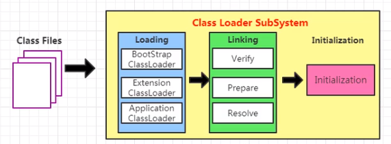
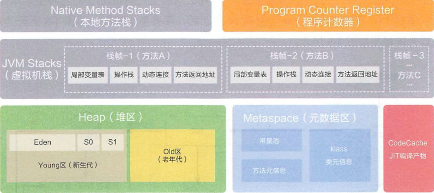

# JVM

## 所需插件

### javap

- javap -c xxx.class
- javap -l xxx.class

### IDEA jclasslib 插件

## 指令集架构
- 基于栈式架构（JVM）
    - 设计和实现更简单，适用于资源受限的系统
    - 避开寄存器的分配难题：使用零地址指令方式分配
    - 指令流中的指令大部分是零地址指令，其执行过程依赖于操作栈指令集更小，编译器容易实现
    - 不需要硬件支持，可移植性更好，更好实现跨平台
- 基于寄存器架构
    - 典型的应用是x86的二进制指令集：传统PC以及Android的Davlik虚拟机
    - 指令集架构完全依赖硬件，可移植性差
    - 性能优秀和执行更高效
    - 花费更少的指令去完成一项操作
    - 在大部分情况下，基于寄存器架构的指令集往往都以一地址指令、二地址指令和三地址指令为主，而基于栈式架构的指令集却是以零地址指令为主
## 复习java知识点
### OOP
- OOP 面向对象：类、对象
- 类基本结构：field（域、属性）、method
## JVM架构

- Class Loader subSystem 类加载子系统
    - 
    - loading 加载
        - Bootstrap ClassLoader c和c++实现的 引导/启动 类加载器（Java核心类库默认使用）
            1. 出于安全考虑Bootstrap只加载包名为java、javax、sun等开头的类
            2. JAVA_HOME/jre/lib下的内容
            3. sun.boot.class.path路径下的内容
            4. 没有父加载器
            5. 加载ExtensionClassloader和AppClassloader，并指定为他们的父类加载器
            6. c/c++实现，嵌套在JVM内部
        - Extension ClassLoader java实现的 扩展 类加载器
            1. 派生于ClassLoader类
            2. 父类加载器为BootstrapClassloader
            3. 从java.ext.dirs系统属性所指定的目录中加载类库
            4. 从JDK的安装路径jre/lib/ext子目录下加载类库（如果用户创建的JAR放在此目录下也会自动由ExtensionClassLoader加载）
            5. java语言编写
        - Application ClassLoader java实现的 系统 类加载器（自定义类型默认使用）
            1. java语言编写由sun.misc.Launcher$AppClassLoader实现
            2. 派生于ClassLoader
            3. 父类加载器为ExtensionClassLoader
            4. 加载环境变量classpath路径下的类库
            5. 加载系统属性java.class.path指定路径下的类库
        - 自定义类加载器
    - Linking 链接
        - Verify 验证
        - Prepare 准备
        - Resolve 解析
    - Initialization 初始化
- Runtime Data Areas 运行时数据区
    - 
    - 阿里巴巴
    - Program Counter Register 程序计数器 pc寄存器 每个线程一份
    - Stack Area 虚拟机栈 每个线程一份
        - stack frame 栈帧
        - local variables 局部变量表
        - operand stack 操作数栈
        - dynamic linking 动态链接
        - return address 方法返回地址
    - Native Method Stack 本地方法栈(调用c语言，与本地方法库、本地方法接口交互)
    - Heap Area 堆区 对象主体存放位置 GC主要管理的区域 多线程共享
    - Method Area 方法区 类信息，常量，域信息，方法信息 多线程共享(JVM规范)
        - HotSpot 有Method Area
            - JDK8 为元空间 metaspace
            - jdk6&7 为永久代 PermGen space
            - Method Area是JVM规范 metaspace、PermGen为method area的落地实现
        - J9（IBM）和JRockit（Oracle）没有Method Area
- Execution Engine 执行引擎
    - Interpreter 解释器
    - JIT Compiler 即时编译器
        - Intermediate Code Generator 中间代码生成器
        - Code Optimizer 代码优化器
        - Target Code Generator 目标代码生成器
        - Profiler 分析器
    - Garbage Collection 垃圾回收器
- Native Method Interface（JNI） 本地方法接口
- Native Method Library 本地方法库

## [classloader_subSystem.md](classloader_subSystem.md)
## [runtime_data_area.md](runtime_data_area.md)
### [program_counter_register.md](program_counter_register.md)
### [stack.md](stack.md)
### [native method stack](native_method.md)
### [heap.md](heap.md)
### [method_area.md](method_area.md)
## [执行引擎]