# JVM

## [jvm tools](https://bougainvilleas.github.io/lotus/jvm/tools.html)

> `javap <options> <classes>`
> > `javap -c xxx.class` : Disassemble反汇编 the code \
> > `javap -l xxx.class` : Print `line number` and `local variable tables 
> >
> > IntelliJ IDEA `jclasslib` 插件

## 指令集架构

- 基于栈式架构（JVM）
    - 设计和实现更简单，适用于资源受限的系统
    - 避开寄存器的分配难题：使用零地址指令方式分配
    - 指令流中的指令大部分是零地址指令，其执行过程依赖于操作栈指令集更小，编译器容易实现
    - 不需要硬件支持，可移植性更好，更好实现跨平台
- 基于寄存器架构
    - 典型的应用是x86的二进制指令集：传统PC以及Android的Davlik虚拟机
    - 指令集架构完全依赖硬件，可移植性差
    - 性能优秀和执行更高效
    - 花费更少的指令去完成一项操作
    - 在大部分情况下，基于寄存器架构的指令集往往都以一地址指令、二地址指令和三地址指令为主，而基于栈式架构的指令集却是以零地址指令为主

## [Class File Structure java8](classfile/java8/ClassFile.md)

## [Java 对象的实例化](https://bougainvilleas.github.io/lotus/jvm/对象的实例化.html)

## JVM架构

> [Class Loader subSystem](https://bougainvilleas.github.io/lotus/jvm/classloadersubsystem.html)类加载子系统
> > [loading](https://bougainvilleas.github.io/lotus/jvm/classloadersubsystem.html#loading)加载
> > > `Bootstrap ClassLoader`引导/启动 类加载器由`c`和`c++`实现，Java核心类库默认使用此加载器加载
> > > > 1. 出于安全考虑`Bootstrap ClassLoader`只加载包名为`java`、`javax`、`sun`等开头的类
> > > > 2. `JAVA_HOME/jre/lib`下的内容
> > > > 3. `sun.boot.class.path`路径下的内容
> > > > 4. 没有父加载器
> > > > 5. 加载`ExtensionClassloader`和`AppClassloader`，并指定为他们的**父类加载器**
> > > > 6. `c/c++`实现，嵌套在`JVM`内部
> > >
> > > `Extension ClassLoader`扩展类加载器由`java`实现
> > > > 1. `java`语言编写，实现位置`sun.misc.Launcher`内静态内部类`static class ExtClassLoader extends URLClassLoader`
> > > > 2. `parent`父类加载器为 `Bootstrap ClassLoader`
> > > > 3. 从`java.ext.dirs`系统属性所指定的目录中加载类库
> > > > 4. 从JDK的安装路径`jre/lib/ext`子目录下加载类库如果用户创建的JAR放在此目录下也会自动由`ExtensionClassLoader`加载
> > >
> > > `Application ClassLoader`系统类加载器由`java`实现，自定义java类型默认使用
> > > > 1. `java`语言编写，实现位置`sun.misc.Launcher`内静态内部类`static class AppClassLoader extends URLClassLoader`
> > > > 2. `parent`父类加载器为 `ExtClassLoader` 扩展类加载器
> > > > 3. 加载环境变量`classpath`路径下的类库
> > > > 4. 加载系统属性`java.class.path`指定路径下的类库
> > >
> > > `User Defined Class Loader` 用户自定义类加载器
> >
> > [Linking](https://bougainvilleas.github.io/lotus/jvm/classloadersubsystem.html#linking)链接
> > > - [Verify](https://bougainvilleas.github.io/lotus/jvm/classloadersubsystem.html#verify)验证
> > > - [Prepare](https://bougainvilleas.github.io/lotus/jvm/classloadersubsystem.html#prepare)准备
> > > - [Resolve](https://bougainvilleas.github.io/lotus/jvm/classloadersubsystem.html#resolve)解析
> >
> > [Initialization](https://bougainvilleas.github.io/lotus/jvm/classloadersubsystem.html#initialization)初始化

> Runtime Data Areas
> - [Program Counter Register](https://bougainvilleas.github.io/lotus/jvm/pcregister.html)
> - [jvm stacks](https://bougainvilleas.github.io/lotus/jvm/jvmstacks.html)
>   - [Stack Frame](https://bougainvilleas.github.io/lotus/jvm/jvmstacks.html#stack-frame)
>     - [Local Variable](https://bougainvilleas.github.io/lotus/jvm/jvmstacks.html#local-variables)
>     - [Operand Stack](https://bougainvilleas.github.io/lotus/jvm/jvmstacks.html#operand-stacks)
>     - [Dynamic Linking](https://bougainvilleas.github.io/lotus/jvm/jvmstacks.html#dynamic-linking)
>     - [Normal Method Invocation Completion](https://bougainvilleas.github.io/lotus/jvm/jvmstacks.html#normal-method-invocation-completion)
>     - [Abrupt Method Invocation Completion](https://bougainvilleas.github.io/lotus/jvm/jvmstacks.html#abrupt-method-invocation-completion)
> - [Native Method Stack](https://bougainvilleas.github.io/lotus/jvm/nativemethodstacks.html)
>   - `Native Method Interface`JNI 本地方法接口
>   - `Native Method Library`本地方法库
> - [Heap Area](https://bougainvilleas.github.io/lotus/jvm/heap.html)
> - [Method Area](https://bougainvilleas.github.io/lotus/jvm/methodarea.html)
>     - `HotSpot` 有`Method Area`
>         - `JDK8` 为元空间 `metaspace`
>         - `jdk6&7` 为永久代 `PermGen space`
>         - `Method Area`是JVM规范. `metaspace`、`PermGen`为`method area`的落地实现
>     - `J9`IBM和`JRockit`Oracle没有`Method Area`

> Execution Engine执行引擎
> - Interpreter解释器
> - JIT Compiler即时编译器
>   - Intermediate Code Generator中间代码生成器
>   - Code Optimizer代码优化器
>   - Target Code Generator目标代码生成器
>   - Profiler分析器
> - Garbage Collection垃圾回收器
