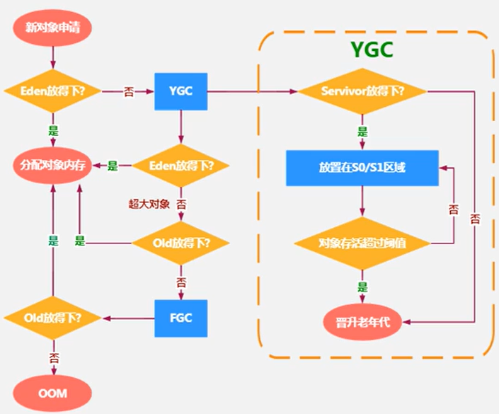

# heap area

## 总结

- YoungGenerationSpace是对象诞生、成长、消亡的区域，一个对象在这里产生、应用，最后被垃圾回收器收集、结束生命
- TenureGenerationSpace放置长生命周期的对象，通常都是从Survivor区筛选拷贝过来的Java对象
    - 特殊情况
        - 普通的对象优先尝试分配在TLAB上
        - 对象较大JVM试图直接在Eden其他位置上
        - 对象太大无法在Yong区找到足够长的连续空闲空间，JVM直接分配到Old区
- MinorGC只发生在Young区，发生频率比MajorGC高很多，效率也比MajorGC高10倍
- 当GC发生在Old区则称为MajorGC或FullGC

## heap area核心概述

- 一个JVM实例只存在一个heap area，heap area是java内存管理的核心区域
- java heap area在JVM启动时即被创建，其空间大小也就确定了，是JVM管理的最大一块内存空间
    - heap area size是可以调节的
- java虚拟机规范 规定 heap可以处于物理上不连续的内存空间中，但在逻辑上它应该被视为连续的
- 所有线程共享java heap area 在这里还可以划分线程私有的缓冲区[TLAB：Thread local allocation buffer](TLAB.md)
- JVM规范对Java Heap描述为：所有对象实例以及数组都应当在运行时分配在堆上（The heap is the run-time data area from which memory for all class instances
  and arrays is allocated）
    - 几乎所有的对象实例都在这里分配内存，almost 不是 all
- 数组和对象可能永远不会存储在stack上，因为stack frame中保存引用，这个引用指向对象或者数组在堆中的位置
- 在方法结束后，堆中对象不会马上被移除，仅仅在垃圾收集的时候才会被移除
- heap area 是Garbage Collection执行垃圾回收的重点区域

## Heap 分代思想

1. 经研究，不同对象的生命周期不同，70%~99%的对象是临时对象
    1. 新生代: 由Eden、两块大小相同的Survivor区（s0、s1或from、to）构成（to总是空的）
    2. 老年代: 存放新生代中经历多次GC仍存活的对象
2. 不分代完全可以

```text
分代的唯一理由就是优化GC性能
如果没有分代，将所有的对象都放在一块，GC时找哪些对象没有用，此时需要对所有区域进行扫描，STW（stop the world）时间相对分代策略会变长
而很对对象都是朝生夕死，
如果分代，把新创建的对象放到某一地方，GC时先把这块存储新创建对象的区域进行回收，STW时间相对不分代的扫描全部区域小很多
```

## heap area 细分 现代垃圾收集器大部分都基于分代收集理论设计

- 新生区--新生代--年轻代
- 养老区--老年区--老年代
- 永久区--永久代

### java7及之前 堆内存 逻辑上 分为三部分

1. Yong Generation Space 新生区 Young/New
    1. Eden区
    2. Survivor区（只有一个存放数据，当jvm计算容量时只会考虑一个，所以Runtime.getRuntime().totalMemory()和Runtime.getRuntime().maxMemory()
       的值会少一个survivor区的大小）
        1. survivor 0 区
        2. survivor 1 区
2. Tenure Generation Space 养老区 Old/Tenure
3. Permanent Space 永久区 Perm

### java8及之后 堆内存 逻辑上 分为三部分

1. Yong Generation Space 新生区 Young/New
    1. Eden区
    2. Survivor区（只有一个存放数据，当jvm计算容量时只会考虑一个，所以Runtime.getRuntime().totalMemory()和Runtime.getRuntime().maxMemory()
       的值会少一个survivor区的大小）
        1. survivor 0 区
        2. survivor 1 区
2. Tenure Generation Space 养老区 Old/Tenure
3. Meta Space 元空间 Meta

### Java对象

```text
存储在JVM中的java对象可以被划分为两类
1.生命周期较短的瞬时对象，这类对象的创建和消亡都非常迅速
2.生命周期非常长，在某些极端的情况下还能够与JVM的生命周期保持一致
```

### 新生代

1. 在Hotspot中Eden空间和另外两个Survivor空间缺省所占比例是8：1：1 ;通过-XX:SurvivorRatio=8(默认为8，但是实际比例是6：1：1 -XX:
   +UseAdaptiveSizePolicy默认开启了自适应内存分配策略，显式添加参数才会生效) 调整比例
2. 几乎所有的Java对象都是在Eden区被new出来
3. 绝大部分的Java对象的销毁都在新生代进行
    - IBM公司的专门研究表明，新生代中80%的对象都是朝生夕死
4. 可以使用选项-Xmn设置新生代最大内存大小
    - 这个参数一般使用默认值就可以了

### 老年代

### 对象分配过程

- 注意
    - 当Eden区满时才会触发YGC，Survivor0或1区满不会触发YGC
    - YGC回收Eden区和From区（YGC后会清空Eden区和From区）
    - Survivor 0区和Survivor 1区大小1：1，肯定会有一个为空。为了使用复制算法，目的是解决碎片化问题
    - Survivor 0区和Survivor 1区：复制之后有交换，谁空谁时To区
    - Garbage Collection频繁在Young区收集，很少在Old区收集，几乎不在Perm/Meta收集
    - 对象可能直接分配在Old区
    - Eden区和To区满了，对象即使没达到阈值，也可能直接晋升到Old区
- 

```text
1. new的对象优先尝试放Eden区，Eden区可能已有对象
2. 如果Eden区剩余空间放得下，则直接在Eden区为对象分配内存
3. 如果Eden区剩余空间放不下，则触发Minor GC(YGC)，YGC会将Eden区和From区清空
    1. 将Eden区和From区内的不再被其他对象所引用的对象进行销毁。
    2. 将Eden区和From区内幸存的对象，移动到To区，并且标识移动次数加1次
    3. 此时Eden区为空，再次判断Eden区是否放得下
        1. 放得下则放Eden区
        2. 放不下则尝试放Old区（一般是超大对象）
            1. 放得下，直接将对象放置到Old区
            2. 放不下，则触发Major GC，回收一次Old区，再进行判断Old区是否放的下
                1. 放得下则直接将对象放置到Old区
                2. 放不下则OOM
4. Survivor 0区和Survivor 1区
    1. 当JVM进程第一次触发YGC。将Eden区内的不再被其他对象所引用的对象进行销毁。
    2. 将Eden区所有幸存对象，尝试移到Survivor 0区（会将Eden区清空）
        1. 当Survivor 0 区空间放得下则放在Survivor 0区，移动次数加1
        2. 幸存对象太大放不下，则直接晋升老年代，放到Old区，移动次数加1
    3. 当Eden区和Survivor 0或1区有数据时触发了YGC。此时JVM将Eden区和Survivor 0区（此时Survivor 0区称为From区）内不再被其他对象所引用的对象进行销毁。(此时的From区要根据实际情况来定，此处只是例子说明)
        1. 尝试将幸存的对象移动到Survivor 1区（此时也叫To区）。
            1. 当From区幸存对象阈值等于设置的值
                1. 则Promotion晋升老年代Old区，移动次数加1
            2. 当From区幸存对象阈值小于设置的值
                1. To区放得下则放到To区，移动次数加1
                2. To区放不下直接放Old区，移动次数加1（此时Old区正常设置参数肯定放的下，因为Young空间一般都比Old空间小）
    4. 之后就是重复3步 
```
### [Garbage Collection](GC.md)
### 内存分配策略

```text
对象提升Promotion规则：
    如果对象在Eden出生并经过第一次MinorGC后仍存活，并且能倍Survivor容纳的化，将被移动到Survivor空间，并将对象年龄设为1
    对象在Survivor区中每熬过一次MinorGC年龄就增加1岁，当它的年龄增加到一定程度(默认15岁，每个JVM每个GC都有所不同)时，就会晋升Promotion到老年代

对象晋升老年代的年龄阈值，可以通过-XX:MaxTenuringThreshold来设置

针对不同年龄段的对象分配原则：
    1.优先分配到Eden
    2.大对象直接分配到老年代
        1.尽量避免程序中出现过多的大对象(连续的内存空间，更高概率触发GC)
    3.长期存活的对象分配到老年代（经过多次YGC仍存活，达到阈值则晋升到老年代）
    4.动态对象年龄判断
        1.如果Survivor区中相同年龄的所有对象大小的综合大于Survivor空间的一半，年龄大于或等于该年龄的对象可以直接进入老年代
            无须等到MaxTenuringThreshold中要求的年龄
    5.空间分配担保
        1. -XX:HandlePromotionFailure
```

### 空间分配担保

```text
在发生MinorGC之前，虚拟机会检查老年代最大可用的连续空间是否大于新生代所有对象的总空间
    1.如果大于则此次MinorGC是安全的
    2.如果小于则虚拟机会查看-XX:HandlePromotionFailure设置值是否运行担保失败
        1.如果-xx:HandlePromotionFailure=true会继续检查老年代最大可用连续空间是否大于历次晋升老年代的对象的平均大小
            1.大于，则尝试进行一次MinorGC，但这次MinorGC是有风险的
            2.小于，则改为进行一次FullGC
        2.如果-xx:HandlePromotionFailure=false则改为进行一次FullGC
在JDK6 Update24之后，HandlePromotionFailure参数不会再影响到JVM的空间分配担保策略，虽然OpenJDK源码中仍定义了HandlePromotionFailure参数，但是在代码中已经不会再使用它
规则变更为
    Old区的连续空间大于新生代对象总大小进行MinorGC
    Old区的连续空间大于历次晋升的平均大小进行MinorGC
    否则进行FullGC
```

### 堆是分配对象存储的唯一选择

```text
随着JIT编译器的发展与逃逸分析技术逐渐成熟，栈上分配、标量替换优化技术将会导致一些微妙变化，所有对象都分配到堆上也渐渐变得不那么绝对

在JVM中，对象是在Java Heap中分配内存，但是如果经过逃逸分析Escape Analysis后发现一个对象并没有逃逸出方法的话，那么就可能被优化成栈上分配
这样无需在heap上分配内存，也不需要GC，这也是常见的堆外存储技术

例如：基于OpenJDK深度定制的TaoBaoVM其中创新的GCIH（GC invisible heap）技术实现off-heap
将生命周期较长的Java对象从Heap中迁移到Heap外，并且GC不能管理GCIH内部的Java对象，以此达到降低GC的回收频率和提升GC的回收效率的目的

```

#### 逃逸分析（不成熟）

- 历史

```text
1. 关于逃逸分析的论文在1999年就已经发表，但直到JDK1.6才有实现，而且这项技术至今也不是十分成熟
2. 原因是：无法保证逃逸分析的性能一定高于他的消耗
   虽然经过逃逸分析可以做标量替换、栈上分配、锁消除。
   但是逃逸分析自身也需要进行一系列复杂的分析，这其实也是一个相当耗时的过程。
   极端的例子，经过逃逸分析后，发现没有一个对象是不逃逸的，那么逃逸分析的过程就白白浪费掉了
3. 虽然不成熟，但是他是即时编译器优化技术中一个十分重要的手段
4. 有些观点认为，通过逃逸分析JVM会在stack上分配不会逃逸的对象，这在理论上是可行的
   但是实际上取决于JVM设计者的选择。
   Oracle HotspotJVM并未这么做，逃逸分析的相关官方文档已经说明，
   所以可以明确所有的对象实例都是创建在heap上
5. 目前很多书籍还是基于JDK7以前的版本，JDK已经发生很大变化，
   intern字符串的缓存和静态变量曾经都被分配在永久代上
   而永久代已经被元空间取代
   但是intern字符串缓存和静态变量并不是转移到元数据区，而是直接在heap上分配，所以这一点同样符合：所有对象实例都是分配在heap上
   
```  

- 概述
    - 使用逃逸分析手段将heap上的对象分配到stack
    - 有效减少Java程序中同步负载和内存heap分配压力的跨函数全局数据流分析算法
    - 通过逃逸分析，hotSpot编译器能够分析出一个新的对象的引用的使用范围从而决定是否要将这个对象分配到heap上
    - 逃逸分析的基本行为就是分析对象动态作用域
        1. 当一个对象在方法中被定义后，对象只在方法内部使用，则认为没有发生逃逸
        2. 当一个对象在方法中被定义后，它被外部方法所引用，则认为发生逃逸。例如作为调用参数传递到其他地方中。
    - 没有发生逃逸的对象，则可以分配到stack上，随着方法执行的结束，该对象随stack frame一起被移除，不需要GC就释放内存
    - JDK6u23后，HotSpot中默认就已经开启了逃逸分析
    - 如果使用的是较早的版本
        - -XX:+DoEscapeAnalysis开启逃逸分析
        - -XX:+PrintEscapeAnalysis查看逃逸分析的筛选结果
- 结论
    - 开发中能使用局部变量的，就不要使用在方法外定义
- 代码优化
    - 栈上分配
        ```text
        将heap分配转化为stack分配，
        如果一个对象在子程序中被分配，要使指向该对象的指针永远不会逃逸，
        对象可能是stack分配的候选，而不是heap分配
        ```
    - 同步省略
        ```text
        如果一个对象被发现只能从一个线程被访问到，那么对于这个对象的操作可以不考虑同步
        ```
    - 标量替换
        ```text
        有的对象可能不需要作为一个连续的内存结构存在，也可以被访问到，
        那么对象的部分（或全部）可以不存储在内存，而是存储在CPU寄存器中
        ```

#### 栈上分配

- JIT编译器在编译期根据逃逸分析的结果发现如果一个对象并没有逃逸出方法，就可能被优化成栈上分配
- 分配完成后，继续在 调用栈 内 执行，最后线程结束，stack被回收，局部变量对象也被回收，这样就不需要GC

#### 同步省略（锁消除）

- 线程同步的代价相当高，同步的后果是降低并发性和性能
- 动态编译同步块的时候，JIT编译器可以借助逃逸分析来判断同步块所使用的锁对象是否只能够被一个线程访问而没有被发布到其他线程
- 如果没有被发布到其他线程，JIT编译器在编译这个同步块的时候就会取消这部分代码的同步，从而提高并发性和性能。这个过程就叫同步省略，也称为锁消除

#### 标量替换

- 标量 Scalar
    - 一个无法再分解成更小的数据的数据。Java中的原始数据类型就是标量
- 聚合量 Aggregate
    - 可以分解的数据。java中的对象就是聚合量，因为他可以分解成其他聚合量和标量
- JIT阶段，如果经过逃逸分析，一个对象不会被外界访问的话（未发生逃逸）
- 就会把这个对象拆解成若干个其中包含的若干个成员变量来代替，这个过程就是标量替换
- 标量替换可以大大减少堆内存的占用，因为一旦不需要创建对象，那么就不再需要分配堆内存了
- 标量替换为栈上分配提供了很好的基础
- -XX:+EliminateAllocations开启标量替换(默认开启)，允许将对象打散分配在stack上

## [内存分析工具](tools.md)