# The pc Register

> [Oracle 官方文档](https://docs.oracle.com/javase/specs/jvms/se8/html/jvms-2.html#jvms-2.5.1)
> > 2.5.1 The pc Register
> > > The Java Virtual Machine can support many threads of execution at once (JLS §17). \
> > > Each Java Virtual Machine thread has its own pc (program counter) register. \
> > > At any point, each Java Virtual Machine thread is executing the code of a single method, namely the current method (§2.6) for that thread. \
> > > If that method is not native, the pc register contains the address of the Java Virtual Machine instruction指令 currently being executed. \
> > > If the method currently being executed by the thread is native, the value of the Java Virtual Machine's pc register is undefined. \
> > > The Java Virtual Machine's pc register is wide enough to hold a returnAddress or a native pointer on the specific具体的 platform.

> `pc Register` 是一块较小的内存空间，它可以看作是当前线程所执行的字节码的行号指示器。\
> 在JVM的**概念模型**里代表所有JVM的统一外观，不同类型的JVM并不一定要完全按照概念模型的定义来进行设计，可能会通过一些更高效率的等价方法去实现它，\
> **字节码解释器**工作时就是通过改变这个计数器的值来选取下一条需要执行的字节码指令，\
> 它是**程序控制流**的指示器，分支、循环、跳转、异常处理、线程恢复等基础功能都需要依赖这个计数器来完成。\
> 
> 由于JVM的多线程是通过**线程轮流切换**、**分配处理器执行时间**的方式来实现的，\ 
> 在任何一个确定的时刻，一个处理器对于多核处理器来说是一个内核都只会执行一条线程中的指令。\
> 因此，为了线程切换后能恢复到正确的执行位置，每条线程都需要有一个独立的程序计数器，各线程之间计数器互不影响，独立存储，这类内存区域为“**线程私有**”的内存
> 
> 如果线程正在执行的是一个**Java方法**，这个计数器记录的是正在执行的**JVM字节码指令地址**;\
> 如果正在执行的是**Native方法**，这个计数器值则应为**Undefined**。\
> 此内存区域是唯一一个在《JVM规范》中**没有规定任何OutOfMemoryError**情况的区域。
> 
> JVM pc Register 并非是广义上的物理寄存器，JVM pc Register是对物理PC寄存器的一种抽象模拟

> 特性：
> 1. The pc Register用来存储指向**下一条指令**的地址，也即是将要执行的指令代码。由**Execution Engine**读取下一条指令
> 2. 是一块**很小**的内存空间，几乎可以忽略不计，也是**运行速度最快**的存储区域
> 3. JVM规范中，每个线程都有它自己的程序计数器记录该线程执行到哪个位置，是线程私有的，生命周期与线程的生命周期保持一致
> 4. 任何时间一个线程都只有一个方法在执行即**当前方法**，The pc Register存储当前线程正在执行的java方法中的将要执行的jvm指令地址
> 5. 当执行native method， The pc Register则是指向**Undefined**，此处涉及**native method stack**
> 6. 程序控制流的指示器，分支、循环、跳转、异常处理、线程恢复等基础功能都依赖The pc Register
> 7. **字节码解释器**工作时就是通过改变The pc Register的值来选取下一条需要执行的字节码指令
> 8. 唯一一个在《JVM规范》中没有规定任何OutOfMemoryError情况的区域

## 面试题

> 为什么使用pc Register记录当前线程的执行地址?
> > 结合JVM的多线程实现方式，多线程下CPU会在各个线程之间切换，切换时需要知道从哪继续执行 \
> > **JVM字节码解释器**就需要通过改变pc Register的值来明确下一条应该执行什么样的字节码指令
>
> PC Register为什么设定为线程私有?
> > 结合JVM的多线程实现方式\
> > 多线程在一个特定的时间段内只会执行其中某一个线程的方法，CPU不停地做任务切换，必然经常导致线程中断或恢复。\
> > 为了能够准确记录各线程正在执行的当前字节码指令地址，为每个线程都分配一个pc Register，各个线程独立计算，互不干扰。\
> > 由于CPU时间片轮限制，众多线程在并发执行过程中，\
> > 任何一个确定的时刻，一个处理器对于多核处理器来说是一个内核只会执行某一个线程中的一条指令。这导致经常中断或恢复\
> > 每个线程在创建后，都会产生自己的**pc Register**和**StackFrame**栈帧，pc Register在各个线程之间互不影响

## 扩展

> CPU时间片
> > CPU分配给各个程序的时间，每个线程被分配一个时间段，称为该线程的时间片，每个程序根据时间片轮流执行

> 并行
> > 多个CPU核心一起执行，某一时刻有多个线程在执行

> 串行
> > 多个线程一起排队有序执行，某一时刻有一个线程在执行

> 并发
> > 多个线程一起执行时，竞争获取cpu时间片，cpu分配时间片给这些线程，这些线程根据时间片轮流执行，故某一时刻其实只有一个线程在执行