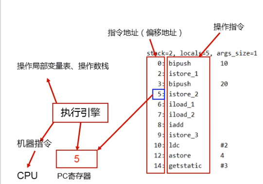

# Program Counter Register

- The Java® Virtual Machine Specification Java SE 8 Edition
    ```text
    2.5.1 The pc Register
    The Java Virtual Machine can support many threads of execution at once (JLS
    §17). Each Java Virtual Machine thread has its own pc (program counter) register.
    At any point, each Java Virtual Machine thread is executing the code of a single
    method, namely the current method (§2.6) for that thread. If that method is not
    native, the pc register contains the address of the Java Virtual Machine instruction
    currently being executed. If the method currently being executed by the thread is
    native, the value of the Java Virtual Machine's pc register is undefined. The Java
    Virtual Machine's pc register is wide enough to hold a returnAddress or a native
    pointer on the specific platform.
    ```
- 翻译为：PC寄存器、程序计数器、程序钩子
- 并非是广义上的物理寄存器，PC寄存器是对物理PC寄存器的一种抽象模拟
- CPU物理寄存器存储指令的现场信息，cpu只有把数据装载到寄存器才能够运行
- 介绍
    1. PC寄存器用来存储指向下一条指令的地址，也即是将要执行的指令代码。由Execution Engine读取下一条指令
    2. 是一块很小的内存空间，几乎可以忽略不计，也是运行速度最快的存储区域
    3. JVM规范中，每个线程都有它自己的程序计数器（记录线程执行到哪个位置），是线程私有的，生命周期与线程的生命周期保持一致
    4. 任何时间一个线程都只有一个方法在执行即当前方法，PC寄存器存储当前线程正在执行的java方法（方法有一系列指令）中的将要执行的jvm指令地址
    5. 当执行本地方法native method（c语言的方法） PC寄存器则是指向undefined，此处涉及native method stack
    6. 程序控制流的指示器，分支、循环、跳转、异常处理、线程恢复等基础功能都依赖PC寄存器
    7. 字节码解释器工作时就是通过改变PC寄存器的值来选取下一条需要执行的字节码指令
    8. 唯一一个在JVM规范中没有规定任何OutOfMemoryError情况的区域
- 例子
- 为什么使用PC寄存器记录当前线程的执行地址

```text
CPU需要不停的切换各个线程，这时候切换回来以后，就得知道接着从哪开始继续执行
JVM字节码解释器就需要通过改变PC寄存器的值来明确下一条应该执行什么样的字节码指令
```

- PC寄存器为什么设定为线程私有

```text
多线程在一个特定的时间段内只会执行其中某一个线程的方法，CPU会不停地做任务切换，这样必然导致经常中断或恢复
为了能够准确记录各个线程正在执行的当前字节码指令地址，所以每个线程都分配一个PC寄存器
各个线程之间可以进行独立计算，从而不互相干扰。

由于CPU时间片轮限制
众多线程在并发执行过程中，任何一个确定的时刻，一个处理器或者多核处理器中的一个内核，只会执行某个线程中的一条指令
这导致经常中断或恢复

每个线程在创建后，都会产生自己的PC寄存器和StackFrame栈帧，PC寄存器在各个线程之间互不影响
```

- CPU时间片:CPU分配给各个程序的时间，每个线程被分配一个时间段，称为该线程的时间片，每个程序根据时间片轮流执行
- 并行 VS 串行
    - 并行: 多个CPU核心一起执行，某一时刻有多个线程在执行
    - 串行: 多个线程一起排队有序执行，某一时刻有一个线程在执行
- 并发：多个线程一起执行时，竞争获取cpu时间片，cpu分配时间片给这些线程，这些线程根据时间片轮流执行，故某一时刻其实只有一个线程在执行