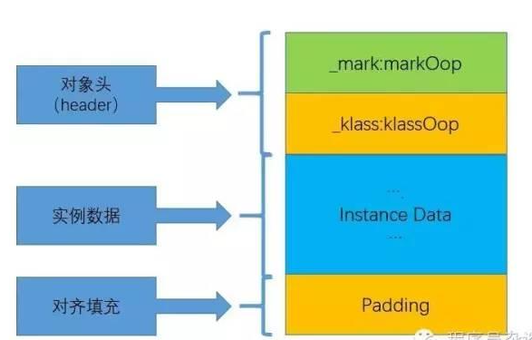
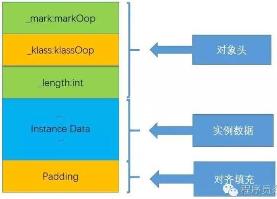

# 对象的实例化
## 创建对象的方式
- new
    1. 最常见的new
    2. 单例模式构造器私有，通过调用静态方法创建对象
    3. XxxBuilder/XxxFactory工厂模式的静态方法创建对象
- Class的newInstance()
    - jdk9过时，反射方式，比较苛刻，只能调用空参的构造器，权限必须是public
- Constructor的newInstance(Xxx)
    - 替代上面，反射，可以调用无参，带参的构造器，权限没有要求
- clone()
    - 不调用任何构造器，当前了需要实现Cloneable接口，实现clone()
- 反序列化
    - 从文件或网络中获取一个对象的二进制流，讲二进制流转换为对象
- 第三方库Objenesis
## 创建对象的步骤
1. 判断对象对应的类是否加载Loader、链接Linking、初始化Initialization
   ```text
   JVM遇到一条new指令，首先去检查这个指令的参数能否在Metaspace的常量池中定位到一个类的符号引用，
   并且检查这个符号引用代表的类是否已经加载、解析、初始化（即判断类元信息是否存在）
   如果没有，那么在双亲委派模式下，使用当前类加载器以ClassLoader+包名+类名为Key进行查找对应的.class文件。
   如果没有找到文件，则抛出ClassNotFoundException
   如果找到，则进行类加载，并生成对应的Class类对象 
   ```
2. 为对象分配内存
    - 如果内存规整
        - 指针碰撞
    - 如果内存不规整
        - 虚拟机需要维护一个列表
        - 空闲列表分配
    - 说明
3. 处理并发安全问题
    - 采用CAS（compare and swap）配上失败重试保证更新的原子性atomic
    - 每个线程预先分配一块TLAB（Thread Local Allocation Buffer）
4. 初始化分配到的空间
    - 所有属性设置默认值，保证对象实例字段在不赋值时可以直接使用
5. 设置对象的对象头
6. 执行<init>方法进行初始化
## 实体对象占用内存计算方式
|类型|字节数(Byte)|位数(bit)|取值范围|
|:---:|:---:|:---:|:---:|
|byte|1|8|-2^7 ~ 2^7-1|
|short|2|16|-2^15 ~ 2^15-1|
|int|4|32|-2^31 ~ 2^31-1|
|long|8|64|-2^63 ~ 2^63-1|
|boolean|1|8|true和false|
|char|2|16|unicode编码，前128字节与ASCII兼容字符存储范围在 \u0000~\uFFFF|
|float|4|32|3.402823e+38 ~ 1.401298e-45（e+38表示是乘以10的38次方，同样，e-45表示乘以10的负45次方）|
|double|8|64|1.797693e+308~ 4.9000000e-324|
|reference|4/8|32/64|引用型数据，32位系统或开启指针压缩的64位系统占用4字节，64位系统不开指针压缩占8字节|
- 实例对象内存计算
- 数组对象内存计算
- 对象头部
  
  |MarkWord|klass指针|length数组长度|
  |:---:|:---:|:---:|
  |32位系统 4byte，64位系统8byte|32位系统和开启指针压缩的64位系统 4byte，64位不开压缩指针8byte|数组对象才有 4byte|
  |存储对象自身运行时数据|指向该类元数据的指针，jvm通过这个指针确定这个对象是哪个类的实例|数组对象记录数组长度|
- 实例数据区
  对象真正存储的有效信息，各类型字段内容，父类继承和自己定义的
    - 继承关系
      ```text
       先存放父类中的成员，接着才是子类中的成员，父类要按照8byte规定对齐
       例如枚举（相当于继承） 有一个String，具体枚举大小=8+4+（4+4）+4=24
       markWord=8，klass=4，父类有一个String=4，父类对齐+4=（4+4）=8，此时大小为20，对齐+4=24   
      ```
- padding 对齐填充
  ```text
  HotSpot VM的自动内存管理系统要求对象起始地址必须是8字节的整数倍，最终字节大小要能被8整除，不能被整除时使用padding补位到能被8整除的长度
  访问未对齐的内存，处理器需要作两次内存访问；而对齐的内存访问仅需要一次访问
  ```
