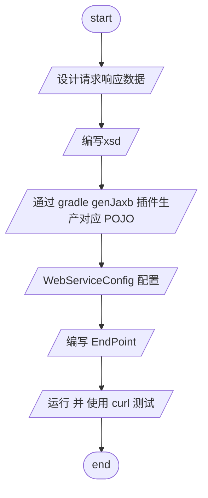

# soap web service server

# 参考文档

- [spring guides](https://spring.io/guides/gs/gs-producing-web-service/) \
- [spring demo](https://github.com/spring-guides/gs-producing-web-service) \
- [Jaxb官方文档中文翻译](https://wenku.baidu.com/view/8fd10ea601d276a20029bd64783e0912a3167c58.html)

> 注意:
> > ant.xjc schema 支持单个file,单个url,或文件夹 下面为不同写法 \
> > 参考[Jaxb 官方文档中文翻译](https://wenku.baidu.com/view/8fd10ea601d276a20029bd64783e0912a3167c58.html)

> url

```groovy
//
ext.url = ext.schema = "http://localhost:8080/ws/countries.wsdl"
xjc(destdir: sourcesDir, schema: url, package: "org.bougainvilleas.spring.wsdl") {
    arg(value: "-wsdl")
    produces(dir: sourcesDir, includes: "**/*.java")
}
```

> 单个文件

```groovy
//单个文件
ext.file = "src/main/resources/xsd/countries.wsdl"
xjc(destdir: sourcesDir, schema: file, package: "org.bougainvilleas.spring.wsdl") {
    arg(value: "-wsdl")
    produces(dir: sourcesDir, includes: "**/*.java")
}
```

> 文件夹

```groovy
// 文件夹
ext.dir = "src/main/resources/xsd"
ext.includes = "*.xsd" //包含
ext.excludes = "tmp.xsd" //排除
xjc(destdir: sourcesDir) {
    schema(dir: dir, includes: includes, excludes: excludes)
    arg(value: "-wsdl")
    produces(dir: sourcesDir, includes: "**/*.java")
}
``` 

## 简单流程 



# curl test

> Use data from file \
> `curl --header "content-type: text/xml" -d @request.xml http://localhost:8080/ws`
> `curl --header "content-type: text/xml" -d @datetime.xml http://localhost:8080/ws`

> [request.xml](src/test/resources/request.xml)

```xml

<soapenv:Envelope xmlns:soapenv="http://schemas.xmlsoap.org/soap/envelope/"
                  xmlns:gs="http://bougainvilleas.org/spring/producingwebservice">
    <soapenv:Header/>
    <soapenv:Body>
        <gs:getCountryRequest>
            <gs:name>Spain</gs:name>
        </gs:getCountryRequest>
    </soapenv:Body>
</soapenv:Envelope>
```

---

> Use inline XML data

```shell
# Use inline XML data
curl <<-EOF -fsSL -H "content-type: text/xml" -d @- http://localhost:8080/ws \
  > build/tmp/response.xml && xmllint --format build/tmp/response.xml

<soapenv:Envelope xmlns:soapenv="http://schemas.xmlsoap.org/soap/envelope/"
                                  xmlns:gs="http://bougainvilleas.org/spring/producingwebservice">
   <soapenv:Header/>
   <soapenv:Body>
      <gs:getCountryRequest>
         <gs:name>Spain</gs:name>
      </gs:getCountryRequest>
   </soapenv:Body>
</soapenv:Envelope>

EOF
```