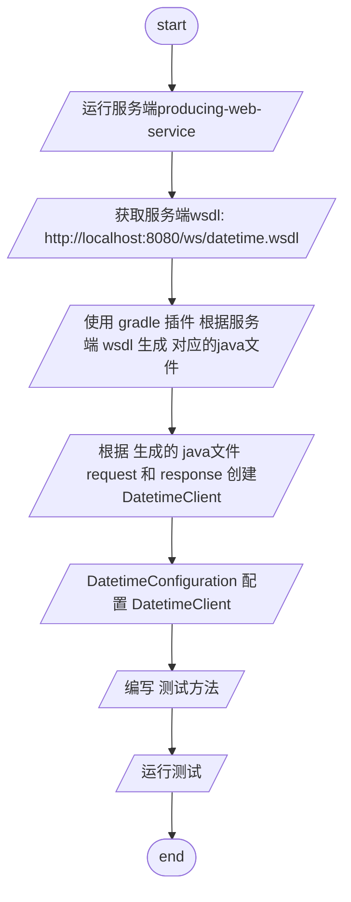

# soap web service client

# 参考文档

- [spring guides](https://spring.io/guides/gs/gs-consuming-web-service/)
- [spring demo](https://github.com/spring-guides/gs-consuming-web-service)
- [Jaxb 官方文档中文翻译](https://wenku.baidu.com/view/8fd10ea601d276a20029bd64783e0912a3167c58.html)

## 简单流程



# 注意

## 首先 执行 genJaxb 根据wsdl 生成必须的 java 文件

> 注意:
> > ant.xjc schema 支持单个file,单个url,或文件夹 下面为不同写法 \
> > 参考[Jaxb 官方文档中文翻译](https://wenku.baidu.com/view/8fd10ea601d276a20029bd64783e0912a3167c58.html)

> url

```groovy
//
ext.url = ext.schema = "http://localhost:8080/ws/countries.wsdl"
xjc(destdir: sourcesDir, schema: url, package: "org.bougainvilleas.spring.wsdl") {
    arg(value: "-wsdl")
    produces(dir: sourcesDir, includes: "**/*.java")
}
```

> 单个文件

```groovy
//单个文件
ext.file = "src/main/resources/xsd/countries.wsdl"
xjc(destdir: sourcesDir, schema: file, package: "org.bougainvilleas.spring.wsdl") {
    arg(value: "-wsdl")
    produces(dir: sourcesDir, includes: "**/*.java")
}
```

> 文件夹

```groovy
// 文件夹
ext.dir = "src/main/resources/xsd"
ext.includes = "*.xsd" //包含
ext.excludes = "tmp.xsd" //排除
xjc(destdir: sourcesDir) {
    schema(dir: dir, includes: includes, excludes: excludes)
    arg(value: "-wsdl")
    produces(dir: sourcesDir, includes: "**/*.java")
}
``` 

> 客户端 为每个 wsdl 创建一个 genJaxb 注意要设置不同包类路径

```groovy
// tag::wsdl[]
task genJaxb {
    ext.sourcesDir = "${buildDir}/generated-sources/jaxb"
    ext.classesDir = "${buildDir}/classes/jaxb"
    ext.schema = "http://localhost:8080/ws/countries.wsdl"

    outputs.dir classesDir

    doLast() {
        project.ant {
            taskdef name: "xjc", classname: "com.sun.tools.xjc.XJCTask",
                    classpath: configurations.jaxb.asPath
            mkdir(dir: sourcesDir)
            mkdir(dir: classesDir)

            xjc(destdir: sourcesDir, schema: schema,
                    package: "org.bougainvilleas.spring.wsdl") {
                arg(value: "-wsdl")
                produces(dir: sourcesDir, includes: "**/*.java")
            }

            javac(destdir: classesDir, source: 1.8, target: 1.8, debug: true,
                    debugLevel: "lines,vars,source",
                    classpath: configurations.jaxb.asPath) {
                src(path: sourcesDir)
                include(name: "**/*.java")
                include(name: "*.java")
            }

            copy(todir: classesDir) {
                fileset(dir: sourcesDir, erroronmissingdir: false) {
                    exclude(name: "**/*.java")
                }
            }
        }
    }
}
// end::wsdl[]
```